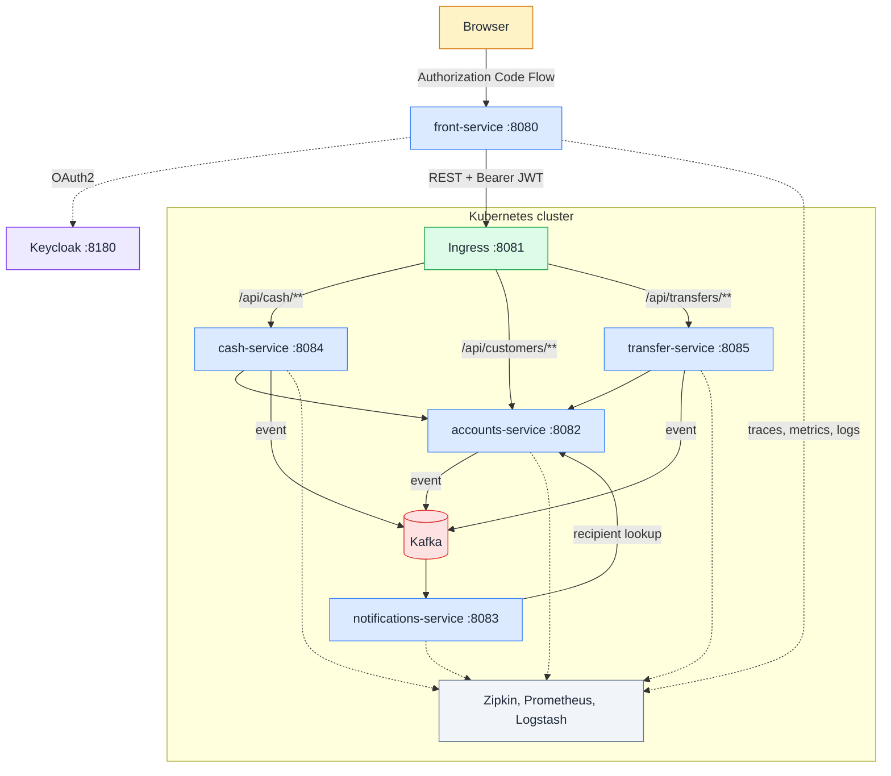
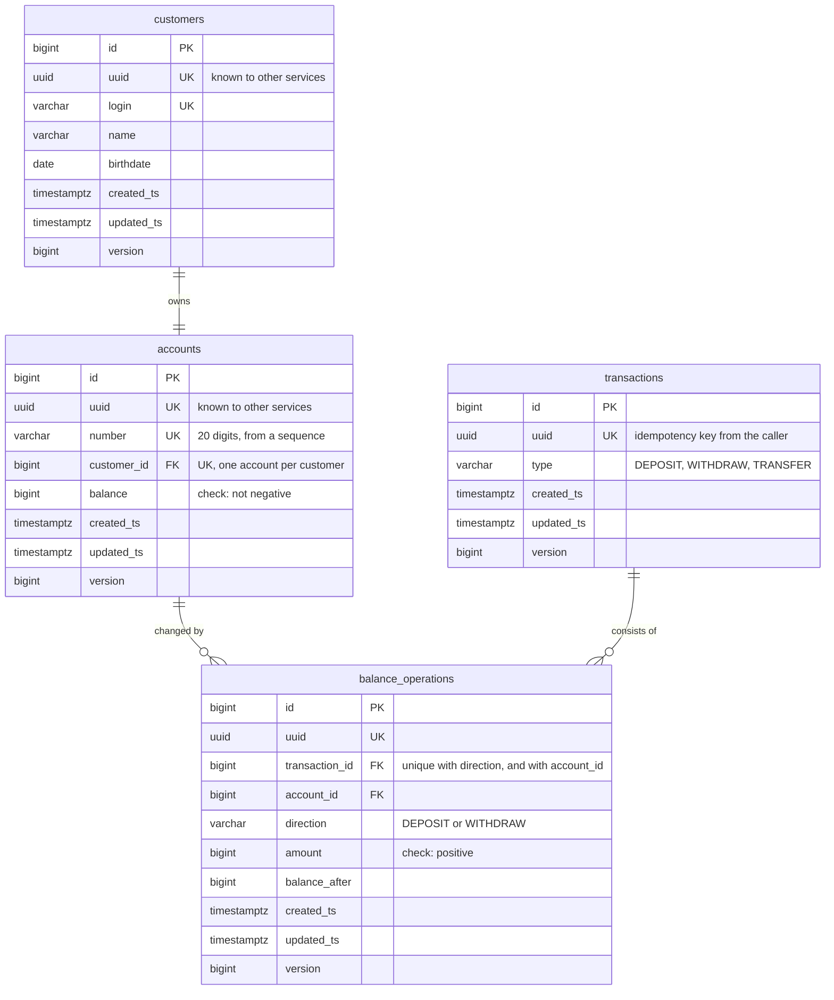
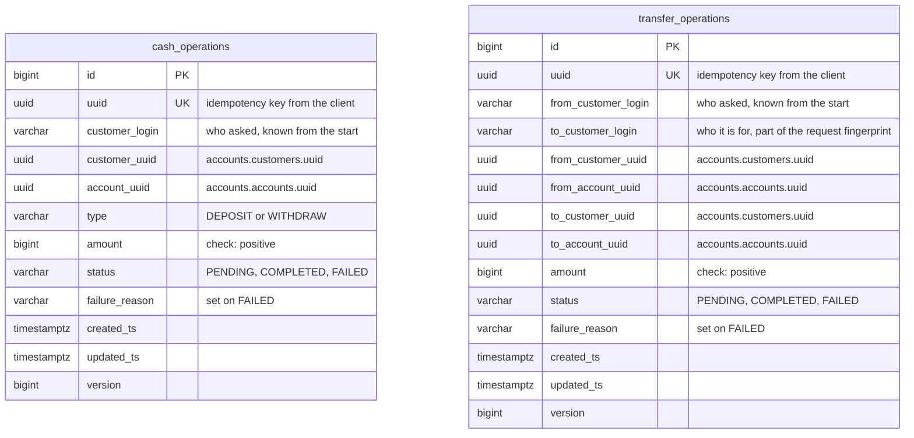
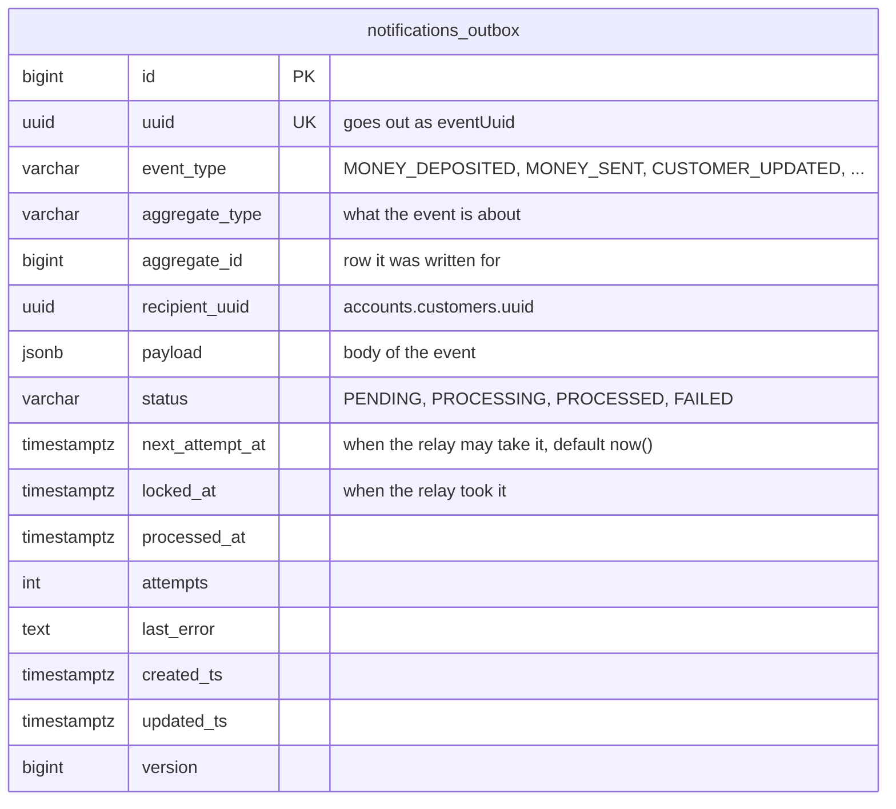
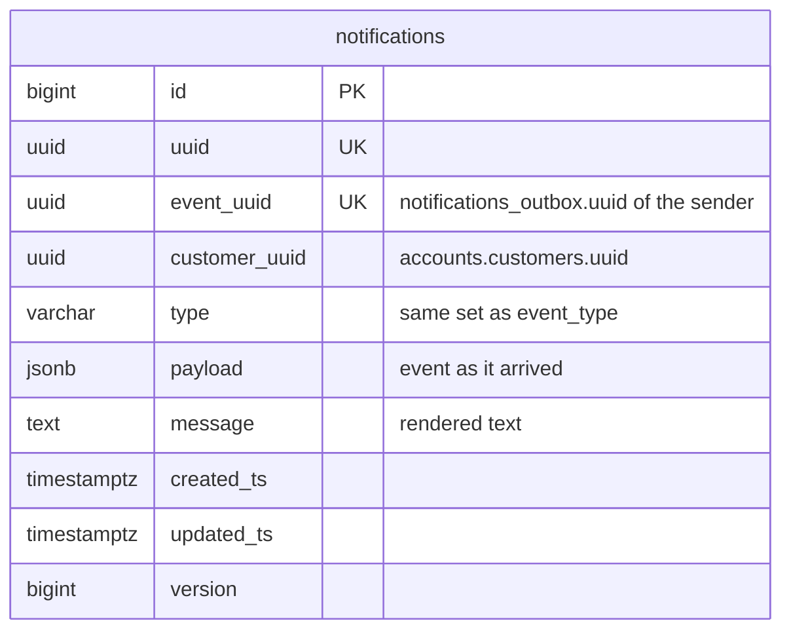

# my-bank-app

Study project with microservice bank app built from five Spring Boot services, deployed to
Kubernetes with Helm.

- **`front-service`**: web UI with profile, cash operations and transfers. Runs outside the cluster.
- **`accounts-service`**: customers, accounts and the transaction ledger. Only this service moves money.
- **`cash-service`**: runs deposits and withdrawals.
- **`transfer-service`**: runs transfers between customers.
- **`notifications-service`**: takes events about money and profile changes, then delivers them.

Four backend services with their databases and one Kafka broker live in Kubernetes. They find each
other by Service DNS and read environment specific settings from ConfigMaps and Secrets. UI reaches
them through an Ingress, single entry point into cluster. Every call is authorized with an OAuth2
token from Keycloak, which runs outside cluster next to UI. Each service that keeps data owns a
private PostgreSQL instance, deployed as a StatefulSet. Services call each other over REST, with one
exception: notifications never arrive that way. A sender writes an event to a transactional outbox
and a relay publishes it to Apache Kafka, which runs in the cluster as its own StatefulSet;
`notifications-service` reads the topic and has no HTTP API at all.

Every service reports what it does to three systems that run in the cluster next to it: traces to
Zipkin, metrics to Prometheus with dashboards and alerts in Grafana, and logs to Logstash, which
stores them in Elasticsearch for Kibana. Traces, metrics and logs come from one place, see
[Observability](#observability).

## Contents

- [Stack](#stack)
- [Layout](#layout)
- [Architecture](#architecture)
- [Build](#build)
- [Run](#run)
- [Configuration](#configuration)
- [Observability](#observability)
- [Test](#test)
- [API](#api)
- [Security](#security)
- [Resilience](#resilience)
- [Idempotency](#idempotency)
- [Notifications over Kafka](#notifications-over-kafka)
- [Storage](#storage)
- [Left out on purpose](#left-out-on-purpose)

## Stack

- Java 21, Spring Boot 4.1, Spring Cloud 2025.1
- Spring MVC in every service
- Spring Security (OAuth2 login, OAuth2 client, OAuth2 resource server)
- Keycloak 26: Authorization Code Flow for users, Client Credentials Flow for services
- Apache Kafka 4.2 in KRaft mode, Spring for Apache Kafka
- Kubernetes (minikube), Helm 3 compatible charts, ingress-nginx
- Spring Data JPA, PostgreSQL 17, Liquibase migrations
- Resilience4j (circuit breakers, time limiters), Spring Framework 7 `@Retryable`
- Traces: Micrometer Tracing with Brave, Zipkin, `datasource-micrometer` for database spans
- Metrics: Micrometer with Spring Boot Actuator, Prometheus, Grafana for dashboards and alerts
- Logs: Logback with `logstash-logback-encoder`, Logstash, Elasticsearch, Kibana
- Thymeleaf for the UI
- Gradle multiproject
- JUnit 5, Mockito, Testcontainers, WireMock, `spring-kafka-test`, Spring Cloud Contract

## Layout

The repository is a Gradle multiproject laid out like this:

```
services/            one folder per service, each with its own Dockerfile
  accounts-service/
  cash-service/
  transfer-service/
  notifications-service/
  front-service/
libs/                shared libraries, published as plain Gradle projects
  bank-chassis/                      batch worker, Logback config, JSON, tracing and metrics defaults
  bank-chassis-web/                  serving HTTP: error handling, request log, login from JWT
  bank-chassis-client/               calling HTTP: client factory, breaker, client credentials
  bank-persistence-starter/
  bank-notifications-outbox-starter/
  bank-contract-kafka/               test only: Kafka side of Spring Cloud Contract messaging
deploy/              everything about deployment
  build-images.sh          builds four service images inside the cluster
  helm/
    bank-common/           library chart: templates every service chart uses
    accounts-service/      service chart: values plus one line per template
    cash-service/
    transfer-service/
    notifications-service/
    kafka/                 broker chart: StatefulSet in KRaft mode, services, volume
    zipkin/                traces: collector and UI
    prometheus/            metrics: scrape config, RBAC for pod discovery
    grafana/               dashboards and alerts, all provisioned from files
      dashboards/            two community dashboards plus one custom here
    elk/                   logs: Elasticsearch, Logstash pipeline, Kibana
    my-bank/               umbrella chart: four services, broker, observability, ingress, smoke test
    build-deps.sh          adds bank-common into the charts that need it
infra/               what app needs to run, kept outside Kubernetes
  docker-compose.yml       Keycloak, and PostgreSQL with Kafka under the local profile
  keycloak/                realm export with clients, scopes and users
  postgres/init/           schema and role creation for the local database
docker-compose.yml   the UI, includes infra/docker-compose.yml
```

A service folder holds `src/main`, `src/test` and, for the three services that publish contracts,
`src/contractTest`. Settings that do not depend on the environment live in the service itself, in
`application.yml`. Shared defaults come from the libraries, and a service imports only the ones it
needs: `bank-chassis-defaults.yml` everywhere, `bank-chassis-web-defaults.yml` where HTTP is served,
`bank-chassis-client-defaults.yml` where HTTP is called, `bank-persistence-defaults.yml` where there
is a database. Addresses, log levels and passwords come from the chart, see
[Configuration](#configuration).

## Architecture

A request from the browser goes to the UI, from the UI through the ingress, and stops at accounts,
the only service that touches money. Notification events are stored in outbox tables, and a relay
publishes them to one Kafka topic that `notifications-service` consumes. Storage is private: a
service that keeps data has its own database and nobody else reads it.



UI and Keycloak run outside cluster, four services with their databases and the broker inside.

Databases are left off the diagram to keep it easy to read. See [Storage](#storage) for schemas and
their tables.

| Service | Port | Where | Responsibility                                                                     |
|---------|------|-------|------------------------------------------------------------------------------------|
| `front-service` | 8080 | outside | Thymeleaf UI, OAuth2 login, calls the ingress                                      |
| Keycloak | 8180 | outside | OAuth2 authorization server, realm `my-bank`                                       |
| Ingress | 8081 | cluster | Single entry point, routes by path, replaces the API gateway                       |
| `accounts-service` | 8082 | cluster | Customers, accounts, transactions. Only place where money moves                    |
| `notifications-service` | 8083 | cluster | Reads events from Kafka, looks up the recipient, renders and delivers. No HTTP API |
| `cash-service` | 8084 | cluster | Deposit and withdraw flow, plus its journal                                        |
| `transfer-service` | 8085 | cluster | Transfer flow, plus its journal                                                    |
| PostgreSQL | 5432 | cluster | One StatefulSet per service that keeps data                                        |
| Kafka | 9092 | cluster | One broker in KRaft mode, topic `notifications`, own volume                        |
| Zipkin | 9411 | cluster | Collects traces from every service and the UI                                      |
| Prometheus | 9090 | cluster | Gets metrics, discovers pods by annotations                                        |
| Grafana | 3000 | cluster | Dashboards and alerts over Prometheus                                              |
| Elasticsearch | 9200 | cluster | Stores log documents                                                               |
| Logstash | 5000 | cluster | Takes JSON log events over TCP, writes them to Elasticsearch                       |
| Kibana | 5601 | cluster | Reads and searches logs                                                            |

Six shared libraries live in `libs/`:

| Library | What it gives |
|---------|---------------|
| `bank-persistence-starter` | `BaseEntity` (id, uuid, timestamps, version), JPA auditing |
| `bank-chassis` | Batch worker skeleton, single Logback config, shared defaults for JSON, tracing and metrics |
| `bank-chassis-web` | Error response, base exception handler, request logging filter, login taken from JWT |
| `bank-chassis-client` | Service client factory: address from config, client credentials token, circuit breaker |
| `bank-notifications-outbox-starter` | Outbox table, save API, relay that publishes events to the Kafka topic |
| `bank-contract-kafka` | Test only: sends and receives contract messages over Kafka, see [Test](#test) |

## Build

Build everything:

```bash
./gradlew build
```

One service:

```bash
./gradlew :cash-service:build
```

Contract stubs go to the local Maven repository, where consumer tests pick them up:

```bash
./gradlew publishToMavenLocal
```

## Run

App runs in two halves: four backend services with their databases, a Kafka broker and the
observability stack in Kubernetes, UI and Keycloak beside them in Docker Compose.

### What you need

- Docker (Docker Desktop, colima or similar)
- `minikube`, `kubectl`, `helm`
- about 8 GiB of memory and 4 CPUs for cluster.
- these ports free on your machine before the cluster starts:

| Port | Taken by | Needed for |
|------|----------|------------|
| 8081 | node port 80, published by minikube | UI and browser reaching the ingress |
| 5000 | node port 30500, published by minikube | UI shipping its logs to Logstash |
| 8080 | Compose | UI |
| 8180 | Compose | Keycloak |
| 5432 | Compose, `local` profile only | PostgreSQL for Gradle runs |

### Start cluster

Ports on your machine are published to ports of the node, and that can only be set at creation time:
8081 to port 80 for the ingress, 5000 to the Logstash node port for logs from the UI.

```bash
minikube start --driver=docker --cpus=4 --memory=8g --ports=8081:80,5000:30500
minikube addons enable ingress
```

Addon brings ingress-nginx, the controller behind our Ingress object. Commands below name cluster
explicitly, so they cannot hit another cluster from your kubeconfig by mistake.

### Build images

Script points Docker client at daemon inside cluster and builds four service images there, so
nothing gets pushed or loaded:

```bash
./deploy/build-images.sh
```

### Install chart

Add library chart into service charts first, then install:

```bash
./deploy/helm/build-deps.sh

helm upgrade --install my-bank deploy/helm/my-bank \
  -n my-bank-dev --create-namespace --kube-context minikube \
  --set accounts-service.secrets.ACCOUNTS_DB_PASSWORD="${ACCOUNTS_DB_PASSWORD:-accounts}" \
  --set notifications-service.secrets.NOTIFICATIONS_DB_PASSWORD="${NOTIFICATIONS_DB_PASSWORD:-notifications}" \
  --set cash-service.secrets.CASH_DB_PASSWORD="${CASH_DB_PASSWORD:-cash}" \
  --set transfer-service.secrets.TRANSFER_DB_PASSWORD="${TRANSFER_DB_PASSWORD:-transfer}" \
  --set grafana.adminPassword="${GRAFANA_ADMIN_PASSWORD:-admin}"
```

Database passwords and the Grafana password are not stored in chart. They are passed at install time
with a shell default, and a missing one stops install with a message naming it.

Check startup:

```bash
kubectl --context=minikube get pods -n my-bank-dev
```

Check entry point. Here 401 is good news: request reached service, service asked for token.

```bash
curl -i http://localhost:8081/api/customers/me
```

### Start UI and Keycloak

```bash
docker compose up -d --build
```

- UI: http://localhost:8080
- Keycloak: http://localhost:8180

Realm `my-bank` is imported from `infra/keycloak/my-bank-realm.json`. Log in as `user1` /
`password1`: page shows profile, balance and three forms.

### Credentials

| Where | Login | Password |
|-------|-------|----------|
| UI at http://localhost:8080 | `user1`, `user2`, `user3` | `password1`, `password2`, `password3` |
| Keycloak admin console | `admin` | `admin` |
| Grafana | `admin` | `admin`, or whatever `--set grafana.adminPassword` was given at install |
| Databases | `<service>_service` | the service name, or whatever `--set <service>-service.secrets.<SERVICE>_DB_PASSWORD` was given |
| Zipkin, Prometheus, Kibana | no authentication | |

Users and the Keycloak admin come from the realm export, so they are the same on every install.
Passwords passed at install time have shell defaults in the commands above, and production takes
them from an existing secret instead, see [Environments](#environments).

### One service at a time

Every service chart installs on its own, handy while working on one service:

```bash
helm upgrade --install accounts deploy/helm/accounts-service \
  -n my-bank-dev --create-namespace --kube-context minikube \
  --set secrets.ACCOUNTS_DB_PASSWORD=accounts
```

Release name is part of pod selector, and a selector cannot change. Switching between both ways
means uninstall, not upgrade:

```bash
helm uninstall accounts notifications cash transfer -n my-bank-dev --kube-context minikube
```

### Environments

Umbrella chart ships three value files. Namespaces keep environments apart:

| File | Changes |
|------|---------|
| `values-dev.yaml` | debug logging |
| `values-test.yaml` | info logging, own ingress hosts and Logstash node port, shorter metrics retention, smaller Elasticsearch heap |
| `values-prod.yaml` | two replicas for accounts, cash and transfer, larger volumes, info logging, secrets taken from existing secrets instead of values, metrics kept for 15 days, larger Elasticsearch and Logstash |

```bash
helm upgrade --install my-bank deploy/helm/my-bank \
  -n my-bank-test --create-namespace --kube-context minikube \
  -f deploy/helm/my-bank/values-test.yaml \
  --set accounts-service.secrets.ACCOUNTS_DB_PASSWORD=accounts \
  --set notifications-service.secrets.NOTIFICATIONS_DB_PASSWORD=notifications \
  --set cash-service.secrets.CASH_DB_PASSWORD=cash \
  --set transfer-service.secrets.TRANSFER_DB_PASSWORD=transfer \
  --set grafana.adminPassword=admin
```

The UI in Compose points at the dev release: the ingress on port 8081 and the Logstash node port on
5000. Another environment publishes its own node port, so both addresses are variables:

```bash
minikube start --driver=docker --cpus=4 --memory=8g --ports=8081:80,5000:30500,5001:30501

LOGSTASH_DESTINATION=host.docker.internal:5001 \
  ZIPKIN_ENDPOINT=http://zipkin-test.127.0.0.1.nip.io:8081/api/v2/spans \
  docker compose up -d front-service
```

Without them the UI keeps sending its logs and traces to the wrong addresses.

For production chart creates no secrets. Create them yourself and name them in `existingSecret`.
Each one needs both keys, database password and client secret:

```bash
kubectl create secret generic my-bank-accounts -n my-bank-prod \
  --from-literal=ACCOUNTS_DB_PASSWORD=... \
  --from-literal=ACCOUNTS_SERVICE_SECRET=...
```

### Stop

```bash
helm uninstall my-bank -n my-bank-dev --kube-context minikube
docker compose down
```

Database volumes stay, so data and schemas survive reinstall. Drop them for a clean start:

```bash
kubectl --context=minikube delete pvc -n my-bank-dev --all
```

### Without cluster

One service also runs from Gradle against a local database. Defaults in `application.yml` point at
`localhost`, so nothing needs setting:

```bash
docker compose --profile local up -d         # PostgreSQL, Kafka and Keycloak
./gradlew :accounts-service:bootRun
```

Keycloak always comes up with Compose, PostgreSQL and Kafka only under the `local` profile: in
cluster each service has a database of its own and the broker runs there too, so local ones are
there for Gradle runs and nothing else. Schemas and roles in the database are created by
`infra/postgres/init/`, and the broker keeps its log in the `kafka-data` volume.

### Logs

Every service logs through one Logback configuration that lives in `bank-chassis`, so the format is
the same everywhere: readable lines on the console, the same events as JSON to Logstash. Incoming
requests are logged as `received` and `handled`, outgoing calls as `calling`, `finished` or
`failed`, business operations report what they applied, and breakers report their own changes as
`circuit breaker accounts-service: CLOSED -> OPEN`. A traceId travels with synchronous REST calls,
so one operation can be followed across every service it touches, in the console and in Kibana
alike. Pod names are shortened here:

```
[cash-service]     2026-08-13T22:14:41.621Z  INFO [6a7e41d13aebe15c7e21f8fafae65db7,7e21f8fafae65db7] r.y.p.m.c.web.RequestLoggingFilter   : received POST /api/cash/deposit
[cash-service]     2026-08-13T22:14:41.636Z DEBUG [6a7e41d13aebe15c7e21f8fafae65db7,d6e2510735e1d84b] r.y.p.m.c.c.ClientLoggingInterceptor : calling accounts-service POST /api/transactions/deposit
[accounts-service] 2026-08-13T22:14:41.648Z  INFO [6a7e41d13aebe15c7e21f8fafae65db7,42decd0b221962f8] r.y.p.m.c.web.RequestLoggingFilter   : received POST /api/transactions/deposit
[accounts-service] 2026-08-13T22:14:41.679Z  INFO [6a7e41d13aebe15c7e21f8fafae65db7,42decd0b221962f8] r.y.p.m.c.web.RequestLoggingFilter   : handled POST /api/transactions/deposit 200 in 31 ms
[cash-service]     2026-08-13T22:14:41.681Z DEBUG [6a7e41d13aebe15c7e21f8fafae65db7,d6e2510735e1d84b] r.y.p.m.c.c.ClientLoggingInterceptor : finished accounts-service POST /api/transactions/deposit 200 OK in 44 ms
[cash-service]     2026-08-13T22:14:41.690Z  INFO [6a7e41d13aebe15c7e21f8fafae65db7,7e21f8fafae65db7] r.y.p.m.c.web.RequestLoggingFilter   : handled POST /api/cash/deposit 200 in 68 ms
```

Delivery of a notification runs under a trace of its own, because the event travels through Kafka:
the relay publishes it in its own thread, and its trace id, not the one of the user request, follows
the event to the consumer. Here the relay of cash-service ships an event, notifications reads it,
asks accounts who the recipient is, and renders the message:

```
[cash-service]          2026-08-20T22:48:30.630Z DEBUG [6a87843e2f3ce5eec1ee2f51176a03e6,c1ee2f51176a03e6] r.y.p.m.chassis.worker.BatchProcessor : Processing 1 items
[notifications-service] 2026-08-20T22:48:30.709Z DEBUG [6a87843e2f3ce5eec1ee2f51176a03e6,204782275e1034dc] r.y.p.m.c.c.ClientLoggingInterceptor : calling accounts-service GET /api/customers/3c1a549b-173a-432a-9260-5e7e6daa52b7
[accounts-service]      2026-08-20T22:48:30.754Z  INFO [6a87843e2f3ce5eec1ee2f51176a03e6,8ad630106c07ef49] r.y.p.m.c.web.RequestLoggingFilter   : handled GET /api/customers/3c1a549b-173a-432a-9260-5e7e6daa52b7 200 in 27 ms
[notifications-service] 2026-08-20T22:48:30.773Z  INFO [6a87843e2f3ce5eec1ee2f51176a03e6,37c5c446073c5f43] r.y.p.m.n.service.NotificationsService : Notification to user1 (Иванов Иван): Счёт *0001: пополнение на 1. Доступно 181 094
```

#### Cluster

All pods at once. The prefix names the pod, and the limit has to be raised because `kubectl` follows
five pods at most:

```bash
kubectl --context=minikube logs -n my-bank-dev -l app.kubernetes.io/part-of=my-bank \
  --prefix -f --max-log-requests=20
```

One service, or one database:

```bash
kubectl --context=minikube logs -n my-bank-dev deploy/cash-service -f
kubectl --context=minikube logs -n my-bank-dev statefulset/cash-service-db -f
```

Pods that appear after the command started are not picked up, so a `helm upgrade` means restarting
it. Tools like `stern` follow pods as they come and go.

#### Compose

```bash
docker compose logs -f front-service
```

## Configuration

Settings split by one rule: whatever differs between deployments belongs to chart, rest belongs to
artifact.

| Layer | Holds | Lives in |
|-------|-------|----------|
| `application.yml` of service | port, schema, scopes, breaker instances, database user, Kafka defaults for local run | service itself |
| `bank-chassis-defaults.yml` and its `-web` and `-client` companions, `bank-persistence-defaults.yml` | shared defaults: JSON, logging pattern, sampling and actuator exposure, client timeouts, breaker and time limiter configs, Keycloak addresses for local run, JPA settings | libraries, imported by services that need them |
| ConfigMap | database URL, addresses of other services, Kafka topic, producer and consumer settings, Keycloak addresses, log levels, Zipkin endpoint, Logstash address | `config` in chart values |
| Secret | database password, client secret, Grafana admin password | `secrets` in chart values, or an existing secret |

ConfigMap is mounted as a file and picked up with `SPRING_CONFIG_ADDITIONAL_LOCATION=file:/config/`,
so it overrides defaults baked into jar. Secret arrives as environment variables under same names
placeholders already use, so code knows nothing about it.

Changing only ConfigMap would leave pods running with old settings, because Deployment itself would
not change. Pod template carries a checksum of ConfigMap, so Helm rolls pods whenever configuration
changes.

## Observability

Every service and the UI ship traces, metrics and logs. Servers run in the cluster, one subchart per
project:

| UI | Address | What it answers |
|----|---------|-----------------|
| Zipkin | http://zipkin.127.0.0.1.nip.io:8081 | where a request spent its time and which call failed |
| Prometheus | http://prometheus.127.0.0.1.nip.io:8081 | raw metrics and scrape targets |
| Grafana | http://grafana.127.0.0.1.nip.io:8081 | dashboards and alerts, see [Credentials](#credentials) |
| Kibana | http://kibana.127.0.0.1.nip.io:8081 | logs of every service in one place |

### Traces

`bank-chassis` brings Micrometer Tracing with Brave and the Zipkin reporter, so every service and
the front service report spans out of box. What one trace covers:

- incoming HTTP requests, tagged with method, path and status;
- outgoing HTTP calls, with the `traceparent` header carrying the trace to the next service;
- database queries, spans for connection, statement and result set, from `datasource-micrometer`;
- Kafka publishes and consumes, turned on with `observation-enabled` for the template and the
  listener.

Sampling level is 1.0. Spans of `/actuator/**` requests and of Spring Security filters are dropped as
noise.

Notification delivery is a trace of its own: the user request only writes an outbox row, and the relay
publishes it later in its own thread, so the Kafka publish and the consume belong to the relay tick.
Joining them would take the trace context stored in the outbox, see
[Left out on purpose](#left-out-on-purpose).

### Metrics

Actuator exposes `/actuator/prometheus` in every service and in the UI, and the endpoint is open
without a token, same as health. The ingress does not route it, so it is reachable from inside the
cluster only, which is what keeps the login tags below out of reach. A real deployment would close it
to everything but the Prometheus service account.

Prometheus finds its targets itself: `kubernetes_sd_configs` asks the API server for pods and keeps
those carrying `prometheus.io/scrape`, taking path and port from the neighbouring annotations. That
needs rights, so the chart creates a ServiceAccount with a Role limited to pods of its namespace. The
UI lives outside the cluster and is scraped as a static target at `host.minikube.internal:8080`.

Beside HTTP, JVM and Spring Boot metrics, services publish three custom counters the task asks for:

| Metric | Tags | Grows when |
|--------|------|------------|
| `bank_cash_operation_failures_total` | `type`, `login`, `reason` | a deposit or a withdrawal was rejected by accounts or accounts was unreachable |
| `bank_transfer_failures_total` | `from_login`, `to_login`, `reason` | a transfer failed, for either reason |
| `bank_notification_delivery_failures_total` | `login`, `reason` | a notification cannot be delivered at all: unknown recipient or a broken event |

### Dashboards and alerts

The datasource, the dashboards and the alert rules are provisioned from files in the chart, so what
the repository holds is what Grafana shows.

| Dashboard | Source |
|-----------|--------|
| JVM (Micrometer) | community dashboard 4701 |
| Spring Boot 3.x Statistics | community dashboard 19004 |
| Bank HTTP and Business | written here, panels below |

| Panel | Query |
|-------|-------|
| Requests per second | `rate(http_server_requests_seconds_count[1m])` by application |
| Latency percentiles | p50, p95 and p99 from `http_server_requests_seconds_bucket` |
| 4xx responses per second | the same rate with `status=~"4.."` |
| 5xx responses per second | the same rate with `status=~"5.."` |
| Failed withdrawals | `bank_cash_operation_failures_total{type="withdraw"}` by login and reason |
| Failed transfers | `bank_transfer_failures_total` by logins and reason |
| Undeliverable notifications | `bank_notification_delivery_failures_total` by login and reason |

Five alert rules ship with the chart, with thresholds in `grafana.alerts` of the values file:

| Alert | Fires when |
|-------|-----------|
| High 5xx share | more than 5% of responses are 5xx for 5 minutes |
| Slow HTTP responses | p95 above 1 second for 5 minutes |
| Failed withdrawals spike | more than 3 failed withdrawals within 5 minutes |
| Failed transfers spike | more than 3 failed transfers within 5 minutes |
| Undeliverable notifications | any notification could not be delivered at all |

Alerts use the default contact point, which sends nothing, and are read in Grafana under Alerting.
Business rules treat missing data as normal: their counters do not exist until the first failure.

### Logs in Kibana

Logback config comes from `bank-chassis`: readable lines on the console, the same events as JSON to
Logstash. The TCP appender is only created when an address is configured, so tests and Gradle runs
stay quiet.

Logstash takes them on port 5000 with the `json_lines` codec and writes to Elasticsearch under
`bank-logs-YYYY.MM.dd`. No filters are needed: events arrive as structured JSON, and neither
passwords nor account numbers are logged.

Services inside the cluster send to `elk-logstash:5000` by Service DNS. The UI runs outside and uses
the node port published at start, `host.docker.internal:5000`. Both its addresses, for logs and for
traces, default to the dev release and are overridden with `LOGSTASH_DESTINATION` and
`ZIPKIN_ENDPOINT` when the cluster runs another environment, which publishes them elsewhere.

Kibana needs one manual step per Elasticsearch volume: in Discover, create a data view over
`bank-logs-*` with `@timestamp` as the time field. Provisioning it would take a job calling the saved
objects API.

After that a query by trace id in Discover collects one operation across services, the same lines
[Logs](#logs) shows on the console.

### Storage of observability data

Nothing here is persistent: Zipkin keeps traces in memory, Prometheus and Elasticsearch write to
`emptyDir`, Grafana has no state at all, and a restarted pod starts empty. Production would give
Prometheus and Elasticsearch volumes of their own, the way service databases have them.

## Test

```bash
./gradlew check
```

`check` runs both `test` and `contractTest`. Contract tests sit in their own source set,
`src/contractTest`.

Integration tests use Testcontainers, so Docker must run. Keycloak is not needed: tests inject
authentication with `spring-security-test` and stub the services they call.

- **Unit and slice**: controllers (`@WebMvcTest` with the real security config), repositories
  (`@DataJpaTest`), mappers and renderers.
- **Integration** (`@SpringBootTest` with Testcontainers PostgreSQL): the cash and transfer flows
  against a real database. Journal transitions, outbox rows, repeats with the same key, expired
  claims and duplicate rejection.
- **Client behaviour**: retries against WireMock (`AccountsClientTest`), and the trace context an
  outgoing call carries in its `traceparent` header.
- **Observability**: `/actuator/prometheus` answers without a token, and the three business counters
  tick with the right tags when an operation fails.
- **Kafka** (`@EmbeddedKafka`): the relay publishes an event and fails when the broker is
  unreachable; an operation in `accounts`, `cash` and `transfer` puts the expected message into the
  topic; `notifications-service` stores what it reads, ignores a repeated `event_uuid` and skips a
  broken event without getting stuck.
- **Contracts** (Spring Cloud Contract): `accounts-service`, `cash-service` and `transfer-service`
  publish producer contracts. Their consumers check requests against the generated stubs with Stub
  Runner. `notifications-service` publishes none any more: it has no API to describe.
- **Message contracts**: every event a service publishes is described by a contract of its own. The
  producer test triggers a real publish and matches what lands in the topic;
  `notifications-service` asks Stub Runner to fire those same contracts by label and then checks
  that the notifications were stored. Spring Cloud Contract ships no Kafka middleware, only
  the interfaces for one, so both sides share `KafkaMessageVerifier` from `bank-contract-kafka`.
  That library is never a runtime dependency: services take it in test configurations only.

### Charts

Two checks need no cluster. First catches broken chart metadata, second prints manifests chart would
send:

```bash
helm lint deploy/helm/my-bank
helm template my-bank deploy/helm/my-bank --set accounts-service.secrets.ACCOUNTS_DB_PASSWORD=x \
  --set notifications-service.secrets.NOTIFICATIONS_DB_PASSWORD=x \
  --set cash-service.secrets.CASH_DB_PASSWORD=x \
  --set transfer-service.secrets.TRANSFER_DB_PASSWORD=x \
  --set grafana.adminPassword=x
```

Chart tests run against an installed release:

```bash
helm test my-bank -n my-bank-dev --kube-context minikube
```

Every service chart brings a test pod that asks its own service for `/actuator/health` and expects
`UP`. The broker chart brings its own: a pod that creates a temporary topic, describes it and
deletes it, which proves the controller works and not only that the port answers. One call proves a
lot: Service resolves by name, its selector matches pods, pod passed readiness, health needs no
token, and database answers, since data source health is part of that answer.

Observability charts bring their own test pods: Zipkin and Grafana answer their health endpoints,
Prometheus is ready and already has the pod discovery job active, Elasticsearch reports a green or
yellow cluster and Kibana is available. Ten test pods in total.

Umbrella chart adds a smoke test that runs after them and goes through ingress. Request without a
token must get 401, request with a made up token must get 401 as well, not 500. Together that shows
route exists, security is on, and signature checking works, which means keys were fetched from
Keycloak.

Money paths stay out of chart tests on purpose: such a test would run against real data, and flows
are already covered by service tests on a build.

Failed test pods are kept, so logs can be read:

```bash
kubectl --context=minikube logs -n my-bank-dev my-bank-smoke-test
```

## API

Service APIs need a Bearer JWT, `front-service` pages use the browser session. Errors share one
shape, `{ code, message }`, plus `validationErrors` for field validation. A token that is missing,
expired or carries no `preferred_username` claim gives `401`.

### `front-service` (browser, session)

| Method | URL | Description |
|--------|-----|-------------|
| GET | `/`, `/account` | Main page: profile, balance, forms |
| POST | `/account` | Update name and birthdate |
| POST | `/cash` | Deposit (`action=PUT`) or withdraw (`action=GET`), two buttons of one form |
| POST | `/transfer` | Transfer to another customer |

### Ingress

The only way into the cluster. Routes by path, no host name involved, so the UI needs one address.
Service to service paths are not published: they are meant for service tokens only.

| Path | Target |
|------|--------|
| `/api/customers` | `accounts-service` |
| `/api/cash` | `cash-service` |
| `/api/transfers` | `transfer-service` |

### `accounts-service`

| Method | URL | Scope | Responses |
|--------|-----|-------|-----------|
| GET | `/api/customers/me` | `customer:read` | `200` profile, account and balance |
| PUT | `/api/customers/me` | `customer:write` | `200`, `400` validation |
| GET | `/api/customers/others` | `customer:others:read` | `200` other customers |
| GET | `/api/customers/{uuid}` | `customer:any:read` | `200`, `404` unknown customer |
| POST | `/api/transactions/deposit` | `transactions:write` | `200`, `404`, `409` replay with other details, `422` balance limit |
| POST | `/api/transactions/withdraw` | `transactions:write` | `200`, `422` not enough money |
| POST | `/api/transactions/transfer` | `transactions:write` | `200`, `422` not enough money or same account |

### `cash-service`

| Method | URL | Scope | Responses |
|--------|-----|-------|-----------|
| POST | `/api/cash/deposit` | `cash:write` | `200`, `400` bad request, `409` duplicate request or key conflict, `422` rejected, `503` accounts down |
| POST | `/api/cash/withdraw` | `cash:write` | same |

### `transfer-service`

| Method | URL | Scope | Responses |
|--------|-----|-------|-----------|
| POST | `/api/transfers` | `transfer:write` | `200`, `400` bad request, `409` duplicate request or key conflict, `422` rejected, `503` accounts down |

### `notifications-service`

No HTTP API: no controllers and no resource server, the only way in is the Kafka topic, see
[Notifications over Kafka](#notifications-over-kafka). The service does not take `bank-chassis-web`
either, so no MVC code of ours is left in it. What stayed on purpose, although the task asks to drop
Spring Web MVC, is `spring-boot-starter-web` itself, declared in the service directly: without a web
application actuator serves nothing, and the pod would lose its readiness and liveness probes. The
security chain allows `/actuator/health` and denies everything else.

## Security

### Users (browser to front-service)

- OAuth2 Authorization Code Flow against Keycloak, realm `my-bank`, client `front-service`.
- Every page needs a session. Anonymous visitors go to Keycloak.
- Logout is RP-initiated, so the session dies locally and at Keycloak.
- CSRF protection is on, Thymeleaf puts the token into every form.

Preloaded users and every other login are listed in [Credentials](#credentials).

### Services (service to service)

Every call between services carries a Bearer JWT taken with the Client Credentials Flow. Each
service with an API is a resource server and checks a scope per endpoint. `notifications-service` is
not one any more: nobody calls it, it reads a topic. `accounts-service` no longer asks for a token
of its own either, so its client is a plain resource server in the realm. No token or a bad one
gives `401`, a missing scope gives `403`.

| Caller | Callee | Scopes |
|--------|--------|--------|
| `front-service` | accounts | `customer:read`, `customer:write`, `customer:others:read` |
| `front-service` | cash | `cash:write` |
| `front-service` | transfer | `transfer:write` |
| `cash-service`, `transfer-service` | accounts | `transactions:write` |
| `notifications-service` | accounts | `customer:any:read` |

Client secrets and database passwords reach a pod as environment variables from a Secret. The
chart either creates that Secret from its values or uses one you created, see
[Configuration](#configuration). Passwords themselves are never stored in the chart.

Observability UIs are the exception to all of the above: only Grafana asks for a login, Zipkin,
Prometheus and Kibana are open to anyone who reaches the port. On a laptop that port is `localhost`
only; a real deployment would put an authenticating proxy in front of them and turn the Elasticsearch
security back on.

## Resilience

The table below shows how service interactions are protected: what the circuit breaker of that call
counts as a failure, whether the call is retried, and the timeouts it runs under.

| Call | Breaker counts as failure | Retries | Timeouts (per attempt) |
|------|---------------------------|---------|------------------------|
| `front-service` → ingress | no response | none | connect 2s, read 25s, limit 30s |
| `cash-service`, `transfer-service` → `accounts-service` | no response, or 5xx | 2 attempts, 200ms apart | connect 2s, read 5s, limit 10s |
| `accounts`, `cash`, `transfer` → Kafka | not a breaker case | next relay pass, backoff doubles to `max-retry-delay` | publish waits 10s, producer gives up after 8s |
| `notifications-service` → `accounts-service` | no response, or 5xx | none | connect 2s, read 5s, limit 10s |

All breakers share the same thresholds: a window of 10 calls, evaluated once 5 of them are in, open
at a failure rate of 50%, open for 30s, then 3 probe calls decide whether to close again.

## Idempotency

Three money endpoints require an `Idempotency-Key` request header with a UUID in it:

```
POST /api/cash/deposit
POST /api/cash/withdraw
POST /api/transfers
```

The UI makes the key when it renders the page and keeps it in a hidden form field. After a
success the key is replaced with a new one. After a failure the same key comes back, so pressing
the button again counts as a repeat and does not start a second payment.

The key goes down the whole chain unchanged. It becomes the row id in the orchestrator journal and
the transaction id in `accounts-service`. Repeats are answered from the journal.
A request that arrives while the first one still runs gets `409 duplicate_request`.

A row that was claimed but never settled, because the service died mid call, blocks its key only
for `mybank.<service>.pending-timeout`, 30 seconds by default. After that a repeat with the same
key takes the row over and finishes it.

A key stands for one request, not for a slot: a repeat may retry an operation but may not change
it. A row is taken over only when the repeat carries the same details and the row either failed or
is still pending past that timeout. Anything else under a key that is already taken answers
`409 idempotency_key_conflict`, and the UI hands out a fresh key so the changed operation can be
sent as its own request.

## Notifications over Kafka

Money and profile events reach `notifications-service` only through Kafka. One topic carries them
all.

| Setting | Value |
|---------|-------|
| Topic | `notifications`, 3 partitions, replication factor 1, created by a `NewTopic` bean, auto creation on the broker is off |
| Message key | `recipientUuid` |
| Value | JSON, `JacksonJsonSerializer` and `JacksonJsonDeserializer` (Jackson 3), type headers off |
| Producer | `acks=all`, idempotent, `delivery.timeout.ms` 8s |
| Consumer | group `notifications-service`, `enable-auto-commit=false`, ack after handling, `auto-offset-reset=earliest`, concurrency 3 |

Delivery is at least once. The event is written into the outbox in the same transaction as the
money, the relay marks the row processed only after the broker confirms the write, and the consumer
moves its offset only after the notification is stored. Duplicates are therefore possible and are
dropped by `event_uuid`, unique in the `notifications` table.

A broken event is not retried: it is logged and skipped, because retrying it would block its
partition. Two things count as broken here: an event without one of the required fields, caught by
bean validation on the listener argument, and an event whose payload lacks a field the message
needs.

When accounts-service is down the recipient cannot be resolved and handling fails. That failure is
retried with a growing back off, and the offset stays where it was, so nothing is lost and the event
is handled as soon as accounts answers. The partition waits meanwhile, and every event behind it
waits too, while the other partitions keep going.

The event carries no profile data of its own. The login and the name of the recipient are asked from
`accounts-service` at the moment the message is rendered, and that is deliberate: a copy of the
profile in every event would widen the contract and go stale the day a customer renames themselves,
while the lookup is one cheap call made only when a name is really needed.

Consumer position is visible from the broker pod: `LAG` at zero means everything published so far is
handled, and `CURRENT-OFFSET` is where a restart continues from.

```bash
kubectl --context=minikube -n my-bank-dev exec kafka-0 -- \
  /opt/kafka/bin/kafka-consumer-groups.sh --bootstrap-server localhost:9092 \
  --describe --group notifications-service
```

## Storage

Every service that keeps data owns a PostgreSQL instance of its own, deployed as a StatefulSet
with its own volume. Inside it the service keeps a named schema, owned by its own role and migrated
by Liquibase on startup. The schema is created once, when the volume is empty, by a small SQL file
that comes from a ConfigMap.

| Owner | Schema | Tables |
|-------|--------|--------|
| `accounts-service` | `accounts` | `customers`, `accounts`, `transactions`, `balance_operations`, `notifications_outbox` |
| `cash-service` | `cash` | `cash_operations`, `notifications_outbox` |
| `transfer-service` | `transfer` | `transfer_operations`, `notifications_outbox` |
| `notifications-service` | `notifications` | `notifications` |

Every table starts with `id` and `uuid` and ends with `created_ts`, `updated_ts` and `version`.
They come from `BaseEntity` in `bank-persistence-starter`: `id` is a local identity key, `uuid` is
the external one, timestamps are filled by JPA auditing and `version` gives optimistic locking. An
`id` never crosses a service boundary, only a `uuid` does, and there are no foreign keys between
schemas.

### `accounts`

Money lives here. One customer owns exactly one account. `transactions` is the unit of
idempotency: the `uuid` comes from the caller and is unique, so a repeat with the same key cannot
apply twice. `balance_operations` records what a transaction did to one account, one row per side,
so a deposit and a withdrawal have one row and a transfer has two.



### `cash` and `transfer`

Orchestrator journals. A row is claimed under the client idempotency key, stays `PENDING` while
the call to accounts runs, and ends as `COMPLETED` or `FAILED`. Account and customer ids arrive
with the answer from accounts, so they are empty until then. Logins are written at claim time,
so a row that never got an answer still says whose request it was, and they take part in the
request fingerprint: a repeat under the same key must carry the same details or it is rejected.



### `notifications_outbox`

The same table in three schemas, created by `bank-notifications-outbox-starter`. A row is written in
the same transaction as the operation it describes. A relay picks up `PENDING` rows, publishes them
to the Kafka topic and marks them `PROCESSED` once the broker confirms the write. Rows stuck in
`PROCESSING` past `stale-timeout` are taken again, and a row that fails `max-attempts` times becomes
`FAILED`. A failed delivery is put off to `next_attempt_at`, doubling the delay every time up to
`max-retry-delay`.



### `notifications`

What was delivered. `event_uuid` is unique, so an event read twice is stored once. The row is
written after the notification is delivered, so a crash in between costs a repeated notification
rather than a lost one.



## Left out on purpose

A few things were left out of scope on purpose, to make the sprint smaller and to deliver the core
functionality first.

**No trace context carried through the outbox.** A user request ends when the outbox row is written,
and the delivery is traced separately, under the relay tick that published it. Joining them would
mean storing the `traceparent` in a column and restoring the context in the relay before it
publishes.

**No scanner to check journals for stuck rows.** A `cash-service` or `transfer-service` process can
die for various reasons while waiting for an answer from accounts, which leaves rows in the
`PENDING` state. The user gets no answer either, presses the button again with the same key, and
everything repairs itself: the repeat goes to accounts under that key and the row is closed.

However, there is one weak spot: if the user reloads the page, a new idempotency key is generated,
and a new key means a new transaction. What might save the user is the balance on the reloaded page: it
comes from accounts, so money that already moved is visible, and there is no reason to send the
operation twice.

A scanner would not close that hole, since it cannot stop a person from sending a second request
after reloading the page. What it would add is that the abandoned row stops lying: it gets settled
against the ledger instead of staying `PENDING` forever. It would also be useful for the failed
transaction notifications that could follow. But those notifications were left out of scope for now
as well.
