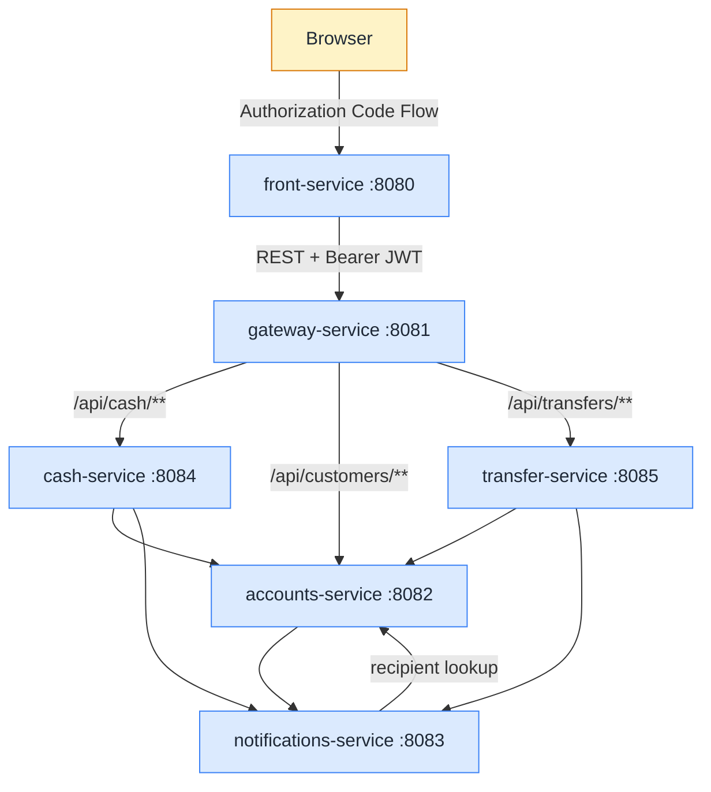
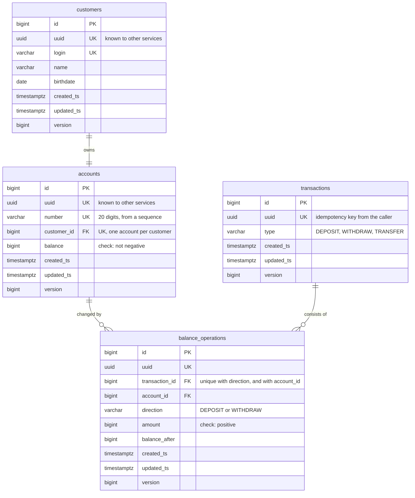
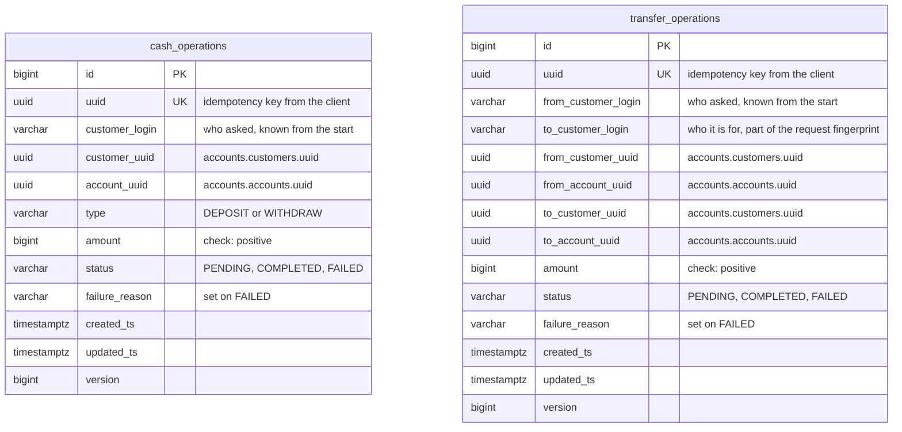
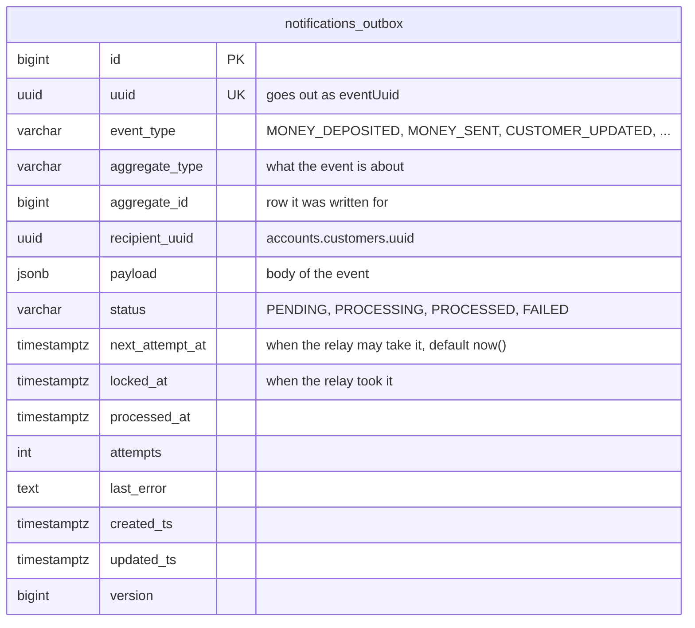
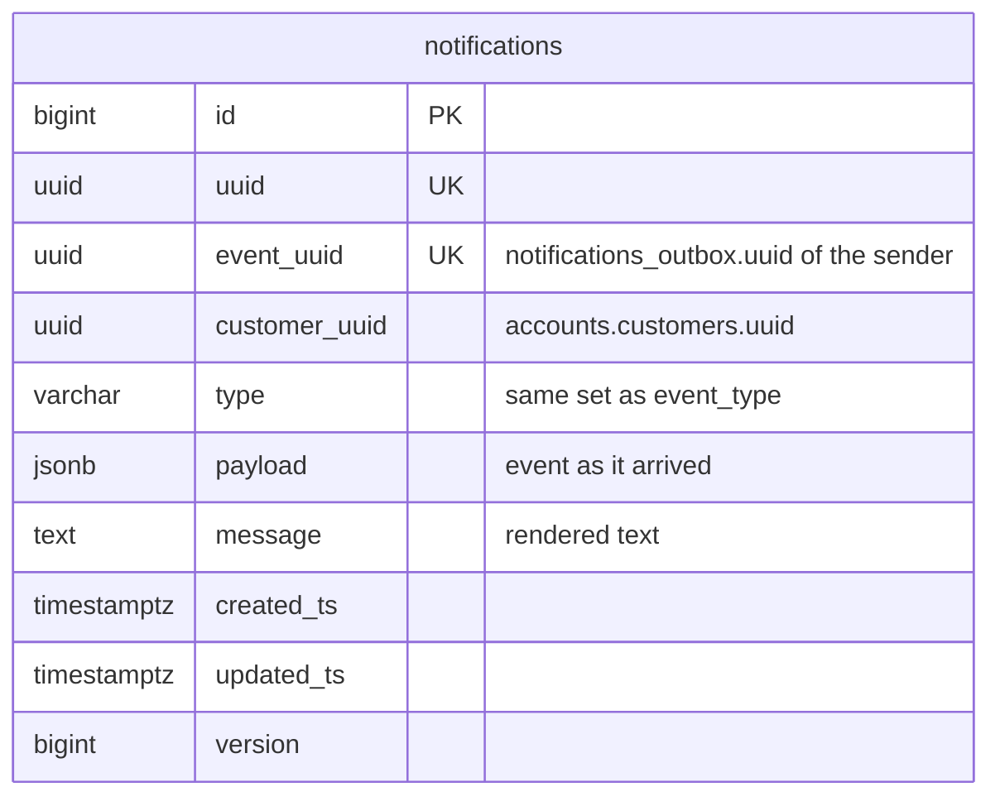

# my-bank-app

Study project with microservice bank app built from six Spring Boot services behind an API gateway.

- **`front-service`**: web UI with profile, cash operations and transfers.
- **`gateway-service`**: single entry point for the UI, does routing, load balancing and breaking.
- **`accounts-service`**: customers, accounts and the transaction ledger. Only this service moves money.
- **`cash-service`**: runs deposits and withdrawals.
- **`transfer-service`**: runs transfers between customers.
- **`notifications-service`**: takes events about money and profile changes, then delivers them.

Services find each other and read their config through Consul. Every call is
authorized with an OAuth2 token from Keycloak. Services that keep data own a private schema in a
shared PostgreSQL instance. Services call each other over REST. The one asynchronous path is
notifications: the sender writes an event to a transactional outbox and a relay ships it.

## Contents

- [Stack](#stack)
- [Layout](#layout)
- [Architecture](#architecture)
- [Build](#build)
- [Run](#run)
- [Test](#test)
- [API](#api)
- [Security](#security)
- [Resilience](#resilience)
- [Idempotency](#idempotency)
- [Storage](#storage)
- [Left out on purpose](#left-out-on-purpose)

## Stack

- Java 21, Spring Boot 4.1, Spring Cloud 2025.1
- Spring MVC in the services, Spring Cloud Gateway on WebFlux in the gateway
- Spring Security (OAuth2 login, OAuth2 client, OAuth2 resource server)
- Keycloak 26: Authorization Code Flow for users, Client Credentials Flow for services
- Consul 1.21: service discovery and configuration
- Spring Data JPA, PostgreSQL 17, Liquibase migrations
- Resilience4j (circuit breakers, time limiters), Spring Framework 7 `@Retryable`
- Thymeleaf for the UI
- Gradle multiproject
- JUnit 5, Mockito, Testcontainers, WireMock, Spring Cloud Contract

## Layout

The repository is a Gradle multiproject laid out like this:

```
services/            one folder per service, each with its own Dockerfile
  accounts-service/
  cash-service/
  transfer-service/
  notifications-service/
  gateway-service/
  front-service/
libs/                shared libraries, published as plain Gradle projects
  bank-chassis/
  bank-persistence-starter/
  bank-notifications-outbox-starter/
infra/               everything the services need to run, but do not own
  docker-compose.yml       PostgreSQL, Consul, Keycloak
  consul/kv/               configuration seeded into Consul KV
  consul/load-kv.sh        seeding script, runs in the consul-kv-init container
  keycloak/                realm export with clients, scopes and users
  postgres/init/           schema and role creation on first start
docker-compose.yml   the six services, includes infra/docker-compose.yml
docker-profile.env   environment shared by the service containers
```

A service folder holds `src/main`, `src/test` and, for the four services that publish contracts,
`src/contractTest`. Files in `infra/consul/kv/` are named after the service they configure, and
`application.yml` there is shared by all of them. The `local` and `docker` subfolders hold the
profile specific overrides.

## Architecture

A request from the browser goes through the gateway and stops at accounts, the only service that
touches money. Notification events are stored in outbox tables and a relay ships them.
Storage is private: a service that keeps data has its own schema and nobody else reads it.



Databases are left off the diagram to keep it easy to read. See [Storage](#storage) for the schemas
and their tables.

| Service | Port | Responsibility |
|---------|------|----------------|
| `front-service` | 8080 | Thymeleaf UI, OAuth2 login, calls the gateway |
| `gateway-service` | 8081 | Routing, load balancing, circuit breakers, fallbacks |
| `accounts-service` | 8082 | Customers, accounts, transactions. Only place where money moves |
| `notifications-service` | 8083 | Accepts events, looks up the recipient, renders and delivers |
| `cash-service` | 8084 | Deposit and withdraw flow, plus its journal |
| `transfer-service` | 8085 | Transfer flow, plus its journal |
| Consul | 8500 | Service discovery, KV configuration |
| Keycloak | 8180 | OAuth2 authorization server, realm `my-bank` |
| PostgreSQL | 5432 | One database, four schemas, one per service that keeps data |

Three shared libraries live in `libs/`:

| Library | What it gives |
|---------|---------------|
| `bank-persistence-starter` | `BaseEntity` (id, uuid, timestamps, version), JPA auditing |
| `bank-chassis` | Error response and base exception handler, service client factory (load balancing, tokens, circuit breaker), batch worker skeleton |
| `bank-notifications-outbox-starter` | Outbox table, save API, relay that ships events to notifications |

## Build

Build everything:

```bash
./gradlew build
```

One service:

```bash
./gradlew :cash-service:build
```

Contract stubs go to the local Maven repository, where consumer tests pick them up:

```bash
./gradlew publishToMavenLocal
```

## Run

### Docker Compose (recommended)

Builds images and starts all six services together with PostgreSQL, Consul and Keycloak:

```bash
docker compose up --build
```

- UI: http://localhost:8080
- Gateway: http://localhost:8081
- Consul UI: http://localhost:8500
- Keycloak: http://localhost:8180 (admin console: `admin`/`admin`)

Realm `my-bank` is imported from `infra/keycloak/my-bank-realm.json`. Consul KV is seeded from
`infra/consul/kv/` by the `consul-kv-init` container before the services start.

Stop and remove:

```bash
docker compose down
```

Stop and drop the databases too:

```bash
docker compose down -v
```

Logs:

```bash
docker compose logs -f cash-service
```

The traceId travels with the synchronous REST calls, so one click looks like this across the
services it touches. Incoming requests are logged as `received` and `handled`, outgoing calls as
`calling`, `finished` or `failed`, and breakers report their own changes as
`circuit breaker cash-service: CLOSED -> OPEN`:

```
front-service-1     | 2026-08-09T09:15:03.945Z  INFO 1 --- [front-service] [nio-8080-exec-1] [6a77ce5300add6189b677fce55b050b9,f598187514eeff2f] r.y.p.m.c.web.RequestLoggingFilter       : received POST /cash
front-service-1     | 2026-08-09T09:15:03.946Z DEBUG 1 --- [front-service] [nio-8080-exec-1] [6a77ce5300add6189b677fce55b050b9,557c0e3488bccf93] r.y.p.m.c.c.ClientLoggingInterceptor     : calling gateway-service POST /api/cash/deposit
gateway-service-1  | 2026-08-09T09:15:03.950Z  INFO 1 --- [gateway-service] [     parallel-1] [6a77ce5300add6189b677fce55b050b9,1b20782cc66d6f67] r.y.p.m.g.web.RequestLoggingFilter       : received POST /api/cash/deposit
cash-service-1      | 2026-08-09T09:15:03.955Z  INFO 1 --- [cash-service] [nio-8084-exec-4] [6a77ce5300add6189b677fce55b050b9,89ff90193cf4deb6] r.y.p.m.c.web.RequestLoggingFilter       : received POST /api/cash/deposit
cash-service-1      | 2026-08-09T09:15:03.959Z DEBUG 1 --- [cash-service] [nio-8084-exec-4] [6a77ce5300add6189b677fce55b050b9,1520736e032c36e1] r.y.p.m.c.c.ClientLoggingInterceptor     : calling accounts-service POST /api/transactions/deposit
accounts-service-1  | 2026-08-09T09:15:03.963Z  INFO 1 --- [accounts-service] [nio-8082-exec-7] [6a77ce5300add6189b677fce55b050b9,fdbd03b3d7d3fd4f] r.y.p.m.c.web.RequestLoggingFilter       : received POST /api/transactions/deposit
accounts-service-1  | 2026-08-09T09:15:03.970Z  INFO 1 --- [accounts-service] [nio-8082-exec-7] [6a77ce5300add6189b677fce55b050b9,fdbd03b3d7d3fd4f] r.y.p.m.c.web.RequestLoggingFilter       : handled POST /api/transactions/deposit 200 in 6 ms
cash-service-1      | 2026-08-09T09:15:03.972Z DEBUG 1 --- [cash-service] [nio-8084-exec-4] [6a77ce5300add6189b677fce55b050b9,1520736e032c36e1] r.y.p.m.c.c.ClientLoggingInterceptor     : finished accounts-service POST /api/transactions/deposit 200 OK in 12 ms
cash-service-1      | 2026-08-09T09:15:03.976Z  INFO 1 --- [cash-service] [nio-8084-exec-4] [6a77ce5300add6189b677fce55b050b9,89ff90193cf4deb6] r.y.p.m.c.web.RequestLoggingFilter       : handled POST /api/cash/deposit 200 in 21 ms
gateway-service-1  | 2026-08-09T09:15:03.979Z  INFO 1 --- [gateway-service] [ctor-http-nio-2] [6a77ce5300add6189b677fce55b050b9,1b20782cc66d6f67] r.y.p.m.g.web.RequestLoggingFilter       : handled POST /api/cash/deposit 200 OK in 28 ms
front-service-1     | 2026-08-09T09:15:03.980Z DEBUG 1 --- [front-service] [nio-8080-exec-1] [6a77ce5300add6189b677fce55b050b9,557c0e3488bccf93] r.y.p.m.c.c.ClientLoggingInterceptor     : finished gateway-service POST /api/cash/deposit 200 OK in 33 ms
front-service-1     | 2026-08-09T09:15:04.020Z  INFO 1 --- [front-service] [nio-8080-exec-1] [6a77ce5300add6189b677fce55b050b9,f598187514eeff2f] r.y.p.m.c.web.RequestLoggingFilter       : handled POST /cash 200 in 74 ms
```

### Locally, service by service

Infrastructure first, then the services:

```bash
docker compose -f infra/docker-compose.yml up -d      # PostgreSQL, Consul (seeded), Keycloak
./gradlew :accounts-service:bootRun
./gradlew :notifications-service:bootRun
./gradlew :cash-service:bootRun
./gradlew :transfer-service:bootRun
./gradlew :gateway-service:bootRun
./gradlew :front-service:bootRun
```

Services started this way use the `local` profile and register in Consul by IP address.

## Test

```bash
./gradlew check
```

`check` runs both `test` and `contractTest`. Contract tests sit in their own source set,
`src/contractTest`.

Integration tests use Testcontainers, so Docker must run. Keycloak and Consul are not needed:
tests inject authentication with `spring-security-test` and stub the services they call.

- **Unit and slice**: controllers (`@WebMvcTest` with the real security config), repositories
  (`@DataJpaTest`), mappers and renderers.
- **Integration** (`@SpringBootTest` with Testcontainers PostgreSQL): the cash and transfer flows
  against a real database. Journal transitions, outbox rows, repeats with the same key, expired
  claims and duplicate rejection.
- **Client behaviour**: retries against WireMock (`AccountsClientTest`), circuit breaker and
  fallback routing in `gateway-service`.
- **Contracts** (Spring Cloud Contract): `accounts-service`, `notifications-service`,
  `cash-service` and `transfer-service` publish producer contracts. Their consumers check requests
  against the generated stubs with Stub Runner.

## API

Service APIs need a Bearer JWT, `front-service` pages use the browser session. Errors share one
shape, `{ code, message }`, plus `validationErrors` for field validation. A token that is missing,
expired or carries no `preferred_username` claim gives `401`.

### `front-service` (browser, session)

| Method | URL | Description |
|--------|-----|-------------|
| GET | `/`, `/account` | Main page: profile, balance, forms |
| POST | `/account` | Update name and birthdate |
| POST | `/cash` | Deposit (`action=PUT`) or withdraw (`action=GET`), two buttons of one form |
| POST | `/transfer` | Transfer to another customer |

### `gateway-service`

| Route | Target | Fallback |
|-------|--------|----------|
| `/api/customers/**` | `accounts-service` | `503 service_unavailable` |
| `/api/cash/**` | `cash-service` | `503 service_unavailable` |
| `/api/transfers/**` | `transfer-service` | `503 service_unavailable` |

### `accounts-service`

| Method | URL | Scope | Responses |
|--------|-----|-------|-----------|
| GET | `/api/customers/me` | `customer:read` | `200` profile, account and balance |
| PUT | `/api/customers/me` | `customer:write` | `200`, `400` validation |
| GET | `/api/customers/others` | `customer:others:read` | `200` other customers |
| GET | `/api/customers/{uuid}` | `customer:any:read` | `200`, `404` unknown customer |
| POST | `/api/transactions/deposit` | `transactions:write` | `200`, `404`, `409` replay with other details, `422` balance limit |
| POST | `/api/transactions/withdraw` | `transactions:write` | `200`, `422` not enough money |
| POST | `/api/transactions/transfer` | `transactions:write` | `200`, `422` not enough money or same account |

### `cash-service`

| Method | URL | Scope | Responses |
|--------|-----|-------|-----------|
| POST | `/api/cash/deposit` | `cash:write` | `200`, `400` bad request, `409` duplicate request or key conflict, `422` rejected, `503` accounts down |
| POST | `/api/cash/withdraw` | `cash:write` | same |

### `transfer-service`

| Method | URL | Scope | Responses |
|--------|-----|-------|-----------|
| POST | `/api/transfers` | `transfer:write` | `200`, `400` bad request, `409` duplicate request or key conflict, `422` rejected, `503` accounts down |

### `notifications-service`

| Method | URL | Scope | Responses |
|--------|-----|-------|-----------|
| POST | `/api/notifications` | `notifications:write` | `200`, `400` bad payload |

## Security

### Users (browser to front-service)

- OAuth2 Authorization Code Flow against Keycloak, realm `my-bank`, client `front-service`.
- Every page needs a session. Anonymous visitors go to Keycloak.
- Logout is RP-initiated, so the session dies locally and at Keycloak.
- CSRF protection is on, Thymeleaf puts the token into every form.

Preloaded users:

| Username | Password |
|----------|----------|
| `user1` | `password1` |
| `user2` | `password2` |
| `user3` | `password3` |

### Services (service to service)

Every call between services carries a Bearer JWT taken with the Client Credentials Flow. Each
service is a resource server and checks a scope per endpoint. No token or a bad one gives `401`,
a missing scope gives `403`.

| Caller | Callee | Scopes |
|--------|--------|--------|
| `front-service` | gateway to accounts | `customer:read`, `customer:write`, `customer:others:read` |
| `front-service` | gateway to cash | `cash:write` |
| `front-service` | gateway to transfer | `transfer:write` |
| `cash-service`, `transfer-service` | accounts | `transactions:write` |
| `cash-service`, `transfer-service`, `accounts-service` | notifications | `notifications:write` |
| `notifications-service` | accounts | `customer:any:read` |

Client secrets come from the environment. Dev defaults live in `docker-profile.env`.

## Resilience

The table below shows how service interactions are protected: what the circuit breaker of that call
counts as a failure, whether the call is retried, and the timeouts it runs under.

| Call | Breaker counts as failure | Retries | Timeouts (per attempt) |
|------|---------------------------|---------|------------------------|
| `front-service` → `gateway-service` | no response | none | connect 2s, read 25s, limit 30s |
| `gateway-service` → `accounts`, `cash`, `transfer` | no response | none | connect 2s, response 15s, limit 20s |
| `cash-service`, `transfer-service` → `accounts-service` | no response, or 5xx | 2 attempts, 200ms apart | connect 2s, read 5s, limit 10s |
| `accounts`, `cash`, `transfer` → `notifications-service` | no response, or 5xx | next relay pass | connect 2s, read 5s, limit 10s |
| `notifications-service` → `accounts-service` | no response, or 5xx | none | connect 2s, read 5s, limit 10s |

All breakers share the same thresholds: a window of 10 calls, evaluated once 5 of them are in, open
at a failure rate of 50%, open for 30s, then 3 probe calls decide whether to close again.

## Idempotency

Three money endpoints require an `Idempotency-Key` request header with a UUID in it:

```
POST /api/cash/deposit
POST /api/cash/withdraw
POST /api/transfers
```

The UI makes the key when it renders the page and keeps it in a hidden form field. After a
success the key is replaced with a new one. After a failure the same key comes back, so pressing
the button again counts as a repeat and does not start a second payment.

The key goes down the whole chain unchanged. It becomes the row id in the orchestrator journal and
the transaction id in `accounts-service`. Repeats are answered from the journal.
A request that arrives while the first one still runs gets `409 duplicate_request`.

A row that was claimed but never settled, because the service died mid call, blocks its key only
for `mybank.<service>.pending-timeout`, 30 seconds by default. After that a repeat with the same
key takes the row over and finishes it.

A key stands for one request, not for a slot: a repeat may retry an operation but may not change
it. A row is taken over only when the repeat carries the same details and the row either failed or
is still pending past that timeout. Anything else under a key that is already taken answers
`409 idempotency_key_conflict`, and the UI hands out a fresh key so the changed operation can be
sent as its own request.

## Storage

One PostgreSQL database with four schemas, one per service that keeps data. Each schema has its
own role and is migrated by Liquibase on startup.

| Owner | Schema | Tables |
|-------|--------|--------|
| `accounts-service` | `accounts` | `customers`, `accounts`, `transactions`, `balance_operations`, `notifications_outbox` |
| `cash-service` | `cash` | `cash_operations`, `notifications_outbox` |
| `transfer-service` | `transfer` | `transfer_operations`, `notifications_outbox` |
| `notifications-service` | `notifications` | `notifications` |

Every table starts with `id` and `uuid` and ends with `created_ts`, `updated_ts` and `version`.
They come from `BaseEntity` in `bank-persistence-starter`: `id` is a local identity key, `uuid` is
the external one, timestamps are filled by JPA auditing and `version` gives optimistic locking. An
`id` never crosses a service boundary, only a `uuid` does, and there are no foreign keys between
schemas.

### `accounts`

Money lives here. One customer owns exactly one account. `transactions` is the unit of
idempotency: the `uuid` comes from the caller and is unique, so a repeat with the same key cannot
apply twice. `balance_operations` records what a transaction did to one account, one row per side,
so a deposit and a withdrawal have one row and a transfer has two.



### `cash` and `transfer`

Orchestrator journals. A row is claimed under the client idempotency key, stays `PENDING` while
the call to accounts runs, and ends as `COMPLETED` or `FAILED`. Account and customer ids arrive
with the answer from accounts, so they are empty until then. Logins are written at claim time,
so a row that never got an answer still says whose request it was, and they take part in the
request fingerprint: a repeat under the same key must carry the same details or it is rejected.



### `notifications_outbox`

The same table in three schemas, created by `bank-notifications-outbox-starter`. A row is written
in the same transaction as the operation it describes. A relay picks up `PENDING` rows, sends them
to `notifications-service` and marks them `PROCESSED`. Rows stuck in `PROCESSING` past
`stale-timeout` are taken again, and a row that fails `max-attempts` times becomes `FAILED`.
A failed delivery is put off to `next_attempt_at`, doubling the delay every time up to
`max-retry-delay`.



### `notifications`

What was delivered. `event_uuid` is unique, so an event sent twice is stored once.



## Left out on purpose

The list below is what was left out of scope on purpose, to make the sprint smaller and to deliver
the core functionality first.

**No scanner to check journals for stuck rows.** A `cash-service` or `transfer-service` process can
die for various reasons while waiting for an answer from accounts, which leaves rows in the
`PENDING` state. The user gets no answer either, presses the button again with the same key, and
everything repairs itself: the repeat goes to accounts under that key and the row is closed.

However, there is one weak spot: if the user reloads the page, a new idempotency key is generated,
and a new key means a new transaction. What might save the user is the balance on the reloaded page: it
comes from accounts, so money that already moved is visible, and there is no reason to send the
operation twice.

A scanner would not close that hole, since it cannot stop a person from sending a second request
after reloading the page. What it would add is that the abandoned row stops lying: it gets settled
against the ledger instead of staying `PENDING` forever. It would also be useful for the failed
transaction notifications that could follow. But those notifications were left out of scope for now
as well.

**Synchronous delivery in notifications-service.** Accepting a notification event resolves the
recipient with a synchronous REST call to accounts-service and renders the message in the same
thread, so accepting depends on accounts being up. However, there is retry logic on the sender
side, so this is partially covered, and therefore async notifications were left out of scope for
now. Moreover, there is no 'real' notification, it is just a logging event, so 'sending' one is not a
time consuming operation.
