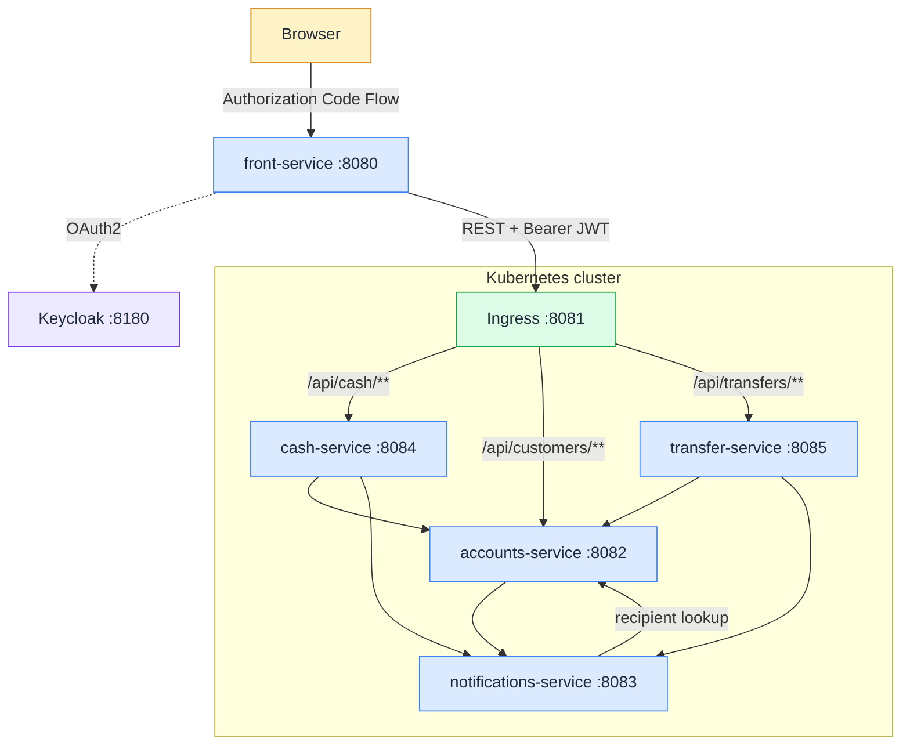
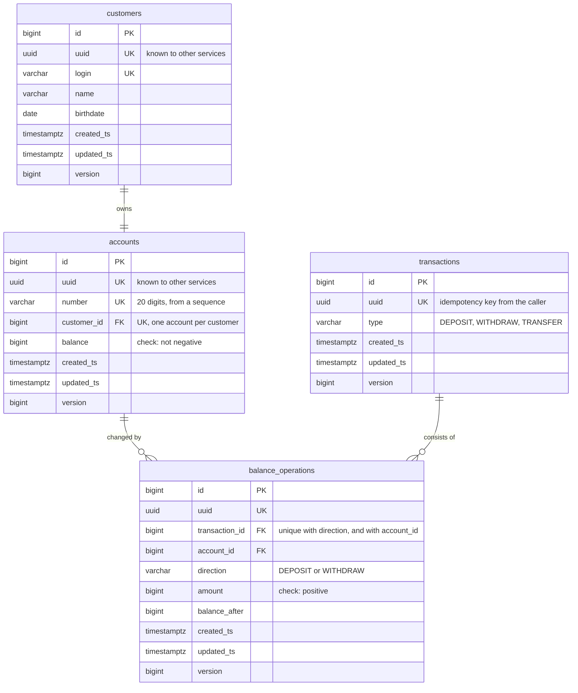
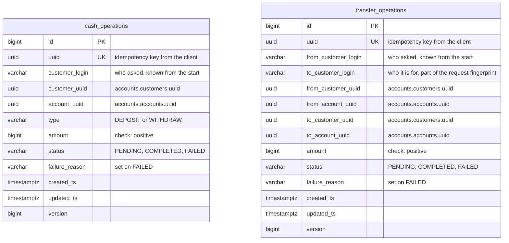
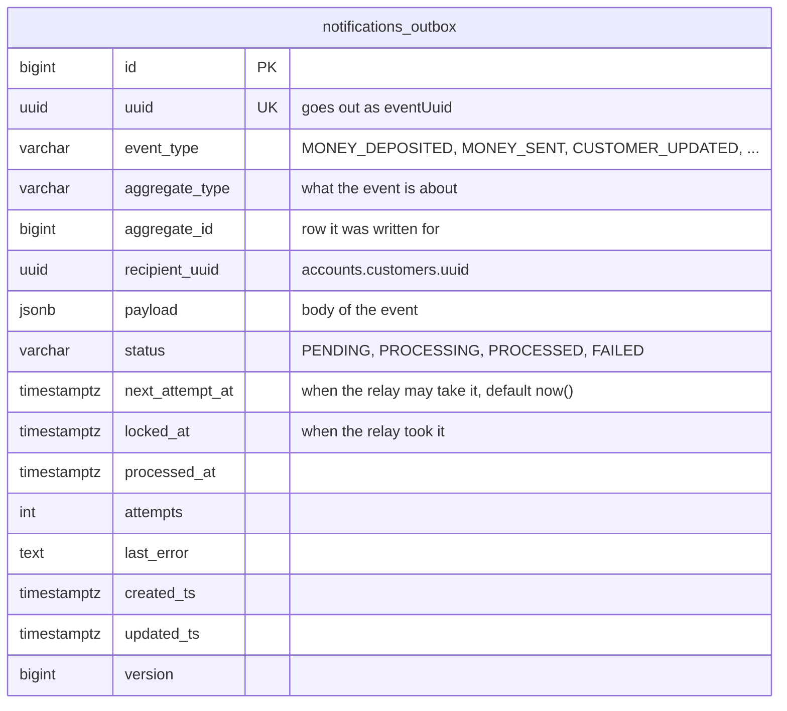
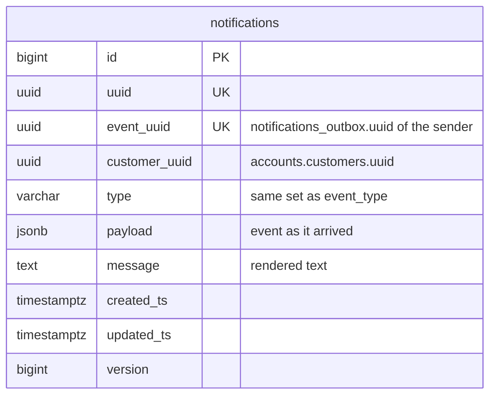

# my-bank-app

Study project with microservice bank app built from five Spring Boot services, deployed to
Kubernetes with Helm.

- **`front-service`**: web UI with profile, cash operations and transfers. Runs outside the cluster.
- **`accounts-service`**: customers, accounts and the transaction ledger. Only this service moves money.
- **`cash-service`**: runs deposits and withdrawals.
- **`transfer-service`**: runs transfers between customers.
- **`notifications-service`**: takes events about money and profile changes, then delivers them.

Four backend services and their databases live in Kubernetes. They find each other by Service DNS
and read environment specific settings from ConfigMaps and Secrets. UI reaches them through an
Ingress, single entry point into cluster. Every call is authorized with an OAuth2 token from
Keycloak, which runs outside cluster next to UI. Each service that keeps data owns a private
PostgreSQL instance, deployed as a StatefulSet. Services call each other over REST. One
asynchronous path is notifications: sender writes an event to a transactional outbox and a relay
ships it.

## Contents

- [Stack](#stack)
- [Layout](#layout)
- [Architecture](#architecture)
- [Build](#build)
- [Run](#run)
- [Configuration](#configuration)
- [Test](#test)
- [API](#api)
- [Security](#security)
- [Resilience](#resilience)
- [Idempotency](#idempotency)
- [Storage](#storage)
- [Left out on purpose](#left-out-on-purpose)

## Stack

- Java 21, Spring Boot 4.1, Spring Cloud 2025.1
- Spring MVC in every service
- Spring Security (OAuth2 login, OAuth2 client, OAuth2 resource server)
- Keycloak 26: Authorization Code Flow for users, Client Credentials Flow for services
- Kubernetes (minikube), Helm 3 compatible charts, ingress-nginx
- Spring Data JPA, PostgreSQL 17, Liquibase migrations
- Resilience4j (circuit breakers, time limiters), Spring Framework 7 `@Retryable`
- Thymeleaf for the UI
- Gradle multiproject
- JUnit 5, Mockito, Testcontainers, WireMock, Spring Cloud Contract

## Layout

The repository is a Gradle multiproject laid out like this:

```
services/            one folder per service, each with its own Dockerfile
  accounts-service/
  cash-service/
  transfer-service/
  notifications-service/
  front-service/
libs/                shared libraries, published as plain Gradle projects
  bank-chassis/
  bank-persistence-starter/
  bank-notifications-outbox-starter/
deploy/              everything about deployment
  build-images.sh          builds four service images inside the cluster
  helm/
    bank-common/           library chart: templates every service chart uses
    accounts-service/      service chart: values plus one line per template
    cash-service/
    transfer-service/
    notifications-service/
    my-bank/               umbrella chart: four services, ingress and smoke test
    build-deps.sh          adds bank-common into the charts that need it
infra/               what app needs to run, kept outside Kubernetes
  docker-compose.yml       Keycloak, and PostgreSQL under the local-db profile
  keycloak/                realm export with clients, scopes and users
  postgres/init/           schema and role creation for the local database
docker-compose.yml   the UI, includes infra/docker-compose.yml
```

A service folder holds `src/main`, `src/test` and, for the four services that publish contracts,
`src/contractTest`. Settings that do not depend on the environment live in the service itself, in
`application.yml`. Shared defaults come from two files in the libraries,
`bank-chassis-defaults.yml` and `bank-persistence-defaults.yml`, which every service imports.
Addresses, log levels and passwords come from the chart, see
[Configuration](#configuration).

## Architecture

A request from the browser goes to the UI, from the UI through the ingress, and stops at accounts,
the only service that touches money. Notification events are stored in outbox tables and a relay
ships them. Storage is private: a service that keeps data has its own database and nobody else
reads it.



UI and Keycloak run outside cluster, four services with their databases inside.

Databases are left off the diagram to keep it easy to read. See [Storage](#storage) for schemas and
their tables.

| Service | Port | Where | Responsibility |
|---------|------|-------|----------------|
| `front-service` | 8080 | outside | Thymeleaf UI, OAuth2 login, calls the ingress |
| Keycloak | 8180 | outside | OAuth2 authorization server, realm `my-bank` |
| Ingress | 8081 | cluster | Single entry point, routes by path, replaces the API gateway |
| `accounts-service` | 8082 | cluster | Customers, accounts, transactions. Only place where money moves |
| `notifications-service` | 8083 | cluster | Accepts events, looks up the recipient, renders and delivers |
| `cash-service` | 8084 | cluster | Deposit and withdraw flow, plus its journal |
| `transfer-service` | 8085 | cluster | Transfer flow, plus its journal |
| PostgreSQL | 5432 | cluster | One StatefulSet per service that keeps data |

Three shared libraries live in `libs/`:

| Library | What it gives |
|---------|---------------|
| `bank-persistence-starter` | `BaseEntity` (id, uuid, timestamps, version), JPA auditing |
| `bank-chassis` | Error response and base exception handler, service client factory (address from config, tokens, circuit breaker), batch worker skeleton, shared Spring defaults |
| `bank-notifications-outbox-starter` | Outbox table, save API, relay that ships events to notifications |

## Build

Build everything:

```bash
./gradlew build
```

One service:

```bash
./gradlew :cash-service:build
```

Contract stubs go to the local Maven repository, where consumer tests pick them up:

```bash
./gradlew publishToMavenLocal
```

## Run

App runs in two halves: four backend services with their databases in Kubernetes, UI and Keycloak
beside them in Docker Compose.

### What you need

- Docker (Docker Desktop, colima or similar)
- `minikube`, `kubectl`, `helm`
- about 4 GiB of memory for cluster

### Start cluster

Port 8081 on your machine is published to port 80 of node, and that is how UI reaches ingress. It
can only be set at creation time.

```bash
minikube start --driver=docker --cpus=4 --memory=4g --ports=8081:80
minikube addons enable ingress
```

Addon brings ingress-nginx, the controller behind our Ingress object. Commands below name cluster
explicitly, so they cannot hit another cluster from your kubeconfig by mistake.

### Build images

Script points Docker client at daemon inside cluster and builds four service images there, so
nothing gets pushed or loaded:

```bash
./deploy/build-images.sh
```

### Install chart

Add library chart into service charts first, then install:

```bash
./deploy/helm/build-deps.sh

helm upgrade --install my-bank deploy/helm/my-bank \
  -n my-bank-dev --create-namespace --kube-context minikube \
  --set accounts-service.secrets.ACCOUNTS_DB_PASSWORD="${ACCOUNTS_DB_PASSWORD:-accounts}" \
  --set notifications-service.secrets.NOTIFICATIONS_DB_PASSWORD="${NOTIFICATIONS_DB_PASSWORD:-notifications}" \
  --set cash-service.secrets.CASH_DB_PASSWORD="${CASH_DB_PASSWORD:-cash}" \
  --set transfer-service.secrets.TRANSFER_DB_PASSWORD="${TRANSFER_DB_PASSWORD:-transfer}"
```

Database passwords are not stored in chart. They are passed at install time with a shell default,
and a missing one stops install with a message naming it.

Check startup:

```bash
kubectl --context=minikube get pods -n my-bank-dev
```

Check entry point. Here 401 is good news: request reached service, service asked for token.

```bash
curl -i http://localhost:8081/api/customers/me
```

### Start UI and Keycloak

```bash
docker compose up -d --build
```

- UI: http://localhost:8080
- Keycloak: http://localhost:8180 (admin console: `admin`/`admin`)

Realm `my-bank` is imported from `infra/keycloak/my-bank-realm.json`. Log in as `user1` /
`password1`: page shows profile, balance and three forms.

### One service at a time

Every service chart installs on its own, handy while working on one service:

```bash
helm upgrade --install accounts deploy/helm/accounts-service \
  -n my-bank-dev --create-namespace --kube-context minikube \
  --set secrets.ACCOUNTS_DB_PASSWORD=accounts
```

Release name is part of pod selector, and a selector cannot change. Switching between both ways
means uninstall, not upgrade:

```bash
helm uninstall accounts notifications cash transfer -n my-bank-dev --kube-context minikube
```

### Environments

Umbrella chart ships three value files. Namespaces keep environments apart:

| File | Changes |
|------|---------|
| `values-dev.yaml` | debug logging |
| `values-test.yaml` | info logging |
| `values-prod.yaml` | two replicas for accounts, cash and transfer, larger volumes, info logging, secrets taken from existing secrets instead of values |

```bash
helm upgrade --install my-bank deploy/helm/my-bank \
  -n my-bank-test --create-namespace --kube-context minikube \
  -f deploy/helm/my-bank/values-test.yaml \
  --set accounts-service.secrets.ACCOUNTS_DB_PASSWORD=accounts \
  --set notifications-service.secrets.NOTIFICATIONS_DB_PASSWORD=notifications \
  --set cash-service.secrets.CASH_DB_PASSWORD=cash \
  --set transfer-service.secrets.TRANSFER_DB_PASSWORD=transfer
```

For production chart creates no secrets. Create them yourself and name them in `existingSecret`.
Each one needs both keys, database password and client secret:

```bash
kubectl create secret generic my-bank-accounts -n my-bank-prod \
  --from-literal=ACCOUNTS_DB_PASSWORD=... \
  --from-literal=ACCOUNTS_SERVICE_SECRET=...
```

### Stop

```bash
helm uninstall my-bank -n my-bank-dev --kube-context minikube
docker compose down
```

Database volumes stay, so data and schemas survive reinstall. Drop them for a clean start:

```bash
kubectl --context=minikube delete pvc -n my-bank-dev --all
```

### Without cluster

One service also runs from Gradle against a local database. Defaults in `application.yml` point at
`localhost`, so nothing needs setting:

```bash
docker compose --profile local-db up -d      # PostgreSQL and Keycloak
./gradlew :accounts-service:bootRun
```

Keycloak always comes up with Compose, PostgreSQL only under the `local-db` profile: in cluster each
service has a database of its own, so a local one is there for Gradle runs and nothing else. Schemas
and roles in it are created by `infra/postgres/init/`.

### Logs

Incoming requests are logged as `received` and `handled`, outgoing calls as `calling`, `finished` or
`failed`, and breakers report their own changes as
`circuit breaker accounts-service: CLOSED -> OPEN`. A traceId travels with synchronous REST calls,
so one operation can be followed across every service it touches. Pod names are shortened here:

```
[cash-service]     2026-08-13T22:14:41.621Z  INFO [6a7e41d13aebe15c7e21f8fafae65db7,7e21f8fafae65db7] r.y.p.m.c.web.RequestLoggingFilter   : received POST /api/cash/deposit
[cash-service]     2026-08-13T22:14:41.636Z DEBUG [6a7e41d13aebe15c7e21f8fafae65db7,d6e2510735e1d84b] r.y.p.m.c.c.ClientLoggingInterceptor : calling accounts-service POST /api/transactions/deposit
[accounts-service] 2026-08-13T22:14:41.648Z  INFO [6a7e41d13aebe15c7e21f8fafae65db7,42decd0b221962f8] r.y.p.m.c.web.RequestLoggingFilter   : received POST /api/transactions/deposit
[accounts-service] 2026-08-13T22:14:41.679Z  INFO [6a7e41d13aebe15c7e21f8fafae65db7,42decd0b221962f8] r.y.p.m.c.web.RequestLoggingFilter   : handled POST /api/transactions/deposit 200 in 31 ms
[cash-service]     2026-08-13T22:14:41.681Z DEBUG [6a7e41d13aebe15c7e21f8fafae65db7,d6e2510735e1d84b] r.y.p.m.c.c.ClientLoggingInterceptor : finished accounts-service POST /api/transactions/deposit 200 OK in 44 ms
[cash-service]     2026-08-13T22:14:41.690Z  INFO [6a7e41d13aebe15c7e21f8fafae65db7,7e21f8fafae65db7] r.y.p.m.c.web.RequestLoggingFilter   : handled POST /api/cash/deposit 200 in 68 ms
```

Delivery of a notification runs on its own, under its own traceId, because a relay picks the event
up later. Here transfer-service ships two events, notifications asks accounts who the recipient is,
and a message is rendered for each side of a transfer:

```
[transfer-service]      2026-08-13T22:12:03.621Z DEBUG [6a7e413378f710a9278ddcd3554200e8,278ddcd3554200e8] r.y.p.m.chassis.worker.BatchProcessor : Processing 2 items
[transfer-service]      2026-08-13T22:12:03.625Z DEBUG [6a7e413378f710a9278ddcd3554200e8,d80c8ecd3511ca6c] r.y.p.m.c.c.ClientLoggingInterceptor  : calling notifications-service POST /api/notifications
[notifications-service] 2026-08-13T22:12:03.657Z  INFO [6a7e413378f710a9278ddcd3554200e8,4e920fc1fd21fbe3] r.y.p.m.c.web.RequestLoggingFilter    : received POST /api/notifications
[notifications-service] 2026-08-13T22:12:03.668Z DEBUG [6a7e413378f710a9278ddcd3554200e8,67ce2b218477ec7e] r.y.p.m.c.c.ClientLoggingInterceptor  : calling accounts-service GET /api/customers/265c5ada-06b2-46ce-b017-2650b0b24dc9
[accounts-service]      2026-08-13T22:12:03.686Z  INFO [6a7e413378f710a9278ddcd3554200e8,04461b6d4940ccb5] r.y.p.m.c.web.RequestLoggingFilter    : received GET /api/customers/265c5ada-06b2-46ce-b017-2650b0b24dc9
[accounts-service]      2026-08-13T22:12:03.694Z  INFO [6a7e413378f710a9278ddcd3554200e8,04461b6d4940ccb5] r.y.p.m.c.web.RequestLoggingFilter    : handled GET /api/customers/265c5ada-06b2-46ce-b017-2650b0b24dc9 200 in 8 ms
[notifications-service] 2026-08-13T22:12:03.702Z  INFO [6a7e413378f710a9278ddcd3554200e8,56ac5fde36d85d54] r.y.p.m.n.service.NotificationsService : Notification to user3 (Сидоров Сидор): Счёт *0003: поступление 5 000 со счёта *0001. Доступно 106 000
[notifications-service] 2026-08-13T22:12:03.755Z  INFO [6a7e413378f710a9278ddcd3554200e8,ad4d5102cfdbc661] r.y.p.m.n.service.NotificationsService : Notification to user1 (Иванов Иван1): Счёт *0001: перевод 5 000 на счёт *0003. Доступно 105 000
[transfer-service]      2026-08-13T22:12:03.758Z DEBUG [6a7e413378f710a9278ddcd3554200e8,b085cd50bf5ffe2a] r.y.p.m.c.c.ClientLoggingInterceptor  : finished notifications-service POST /api/notifications 200 OK in 35 ms
```

#### Cluster

All pods at once. The prefix names the pod, and the limit has to be raised because `kubectl` follows
five pods at most:

```bash
kubectl --context=minikube logs -n my-bank-dev -l app.kubernetes.io/part-of=my-bank \
  --prefix -f --max-log-requests=10
```

One service, or one database:

```bash
kubectl --context=minikube logs -n my-bank-dev deploy/cash-service -f
kubectl --context=minikube logs -n my-bank-dev statefulset/cash-service-db -f
```

Pods that appear after the command started are not picked up, so a `helm upgrade` means restarting
it. Tools like `stern` follow pods as they come and go.

#### Compose

```bash
docker compose logs -f front-service
```

## Configuration

Settings split by one rule: whatever differs between deployments belongs to chart, rest belongs to
artifact.

| Layer | Holds | Lives in |
|-------|-------|----------|
| `application.yml` of service | port, schema, scopes, breaker instances, database user | service itself |
| `bank-chassis-defaults.yml`, `bank-persistence-defaults.yml` | shared defaults: JSON, client timeouts, breaker and time limiter configs, logging pattern, Keycloak addresses for local run, JPA settings | libraries, imported by every service |
| ConfigMap | database URL, addresses of other services, Keycloak addresses, log levels | `config` in chart values |
| Secret | database password, client secret | `secrets` in chart values, or an existing secret |

ConfigMap is mounted as a file and picked up with `SPRING_CONFIG_ADDITIONAL_LOCATION=file:/config/`,
so it overrides defaults baked into jar. Secret arrives as environment variables under same names
placeholders already use, so code knows nothing about it.

Changing only ConfigMap would leave pods running with old settings, because Deployment itself would
not change. Pod template carries a checksum of ConfigMap, so Helm rolls pods whenever configuration
changes.

## Test

```bash
./gradlew check
```

`check` runs both `test` and `contractTest`. Contract tests sit in their own source set,
`src/contractTest`.

Integration tests use Testcontainers, so Docker must run. Keycloak is not needed: tests inject
authentication with `spring-security-test` and stub the services they call.

- **Unit and slice**: controllers (`@WebMvcTest` with the real security config), repositories
  (`@DataJpaTest`), mappers and renderers.
- **Integration** (`@SpringBootTest` with Testcontainers PostgreSQL): the cash and transfer flows
  against a real database. Journal transitions, outbox rows, repeats with the same key, expired
  claims and duplicate rejection.
- **Client behaviour**: retries against WireMock (`AccountsClientTest`).
- **Contracts** (Spring Cloud Contract): `accounts-service`, `notifications-service`,
  `cash-service` and `transfer-service` publish producer contracts. Their consumers check requests
  against the generated stubs with Stub Runner.

### Charts

Two checks need no cluster. First catches broken chart metadata, second prints manifests chart would
send:

```bash
helm lint deploy/helm/my-bank
helm template my-bank deploy/helm/my-bank --set accounts-service.secrets.ACCOUNTS_DB_PASSWORD=x \
  --set notifications-service.secrets.NOTIFICATIONS_DB_PASSWORD=x \
  --set cash-service.secrets.CASH_DB_PASSWORD=x \
  --set transfer-service.secrets.TRANSFER_DB_PASSWORD=x
```

Chart tests run against an installed release:

```bash
helm test my-bank -n my-bank-dev --kube-context minikube
```

Every service chart brings a test pod that asks its own service for `/actuator/health` and expects
`UP`. One call proves a lot: Service resolves by name, its selector matches pods, pod passed
readiness, health needs no token, and database answers, since data source health is part of that
answer.

Umbrella chart adds a smoke test that runs after them and goes through ingress. Request without a
token must get 401, request with a made up token must get 401 as well, not 500. Together that shows
route exists, security is on, and signature checking works, which means keys were fetched from
Keycloak.

Money paths stay out of chart tests on purpose: such a test would run against real data, and flows
are already covered by service tests on a build.

Failed test pods are kept, so logs can be read:

```bash
kubectl --context=minikube logs -n my-bank-dev my-bank-smoke-test
```

## API

Service APIs need a Bearer JWT, `front-service` pages use the browser session. Errors share one
shape, `{ code, message }`, plus `validationErrors` for field validation. A token that is missing,
expired or carries no `preferred_username` claim gives `401`.

### `front-service` (browser, session)

| Method | URL | Description |
|--------|-----|-------------|
| GET | `/`, `/account` | Main page: profile, balance, forms |
| POST | `/account` | Update name and birthdate |
| POST | `/cash` | Deposit (`action=PUT`) or withdraw (`action=GET`), two buttons of one form |
| POST | `/transfer` | Transfer to another customer |

### Ingress

The only way into the cluster. Routes by path, no host name involved, so the UI needs one address.
Service to service paths are not published: they are meant for service tokens only.

| Path | Target |
|------|--------|
| `/api/customers` | `accounts-service` |
| `/api/cash` | `cash-service` |
| `/api/transfers` | `transfer-service` |

### `accounts-service`

| Method | URL | Scope | Responses |
|--------|-----|-------|-----------|
| GET | `/api/customers/me` | `customer:read` | `200` profile, account and balance |
| PUT | `/api/customers/me` | `customer:write` | `200`, `400` validation |
| GET | `/api/customers/others` | `customer:others:read` | `200` other customers |
| GET | `/api/customers/{uuid}` | `customer:any:read` | `200`, `404` unknown customer |
| POST | `/api/transactions/deposit` | `transactions:write` | `200`, `404`, `409` replay with other details, `422` balance limit |
| POST | `/api/transactions/withdraw` | `transactions:write` | `200`, `422` not enough money |
| POST | `/api/transactions/transfer` | `transactions:write` | `200`, `422` not enough money or same account |

### `cash-service`

| Method | URL | Scope | Responses |
|--------|-----|-------|-----------|
| POST | `/api/cash/deposit` | `cash:write` | `200`, `400` bad request, `409` duplicate request or key conflict, `422` rejected, `503` accounts down |
| POST | `/api/cash/withdraw` | `cash:write` | same |

### `transfer-service`

| Method | URL | Scope | Responses |
|--------|-----|-------|-----------|
| POST | `/api/transfers` | `transfer:write` | `200`, `400` bad request, `409` duplicate request or key conflict, `422` rejected, `503` accounts down |

### `notifications-service`

| Method | URL | Scope | Responses |
|--------|-----|-------|-----------|
| POST | `/api/notifications` | `notifications:write` | `200`, `400` bad payload |

## Security

### Users (browser to front-service)

- OAuth2 Authorization Code Flow against Keycloak, realm `my-bank`, client `front-service`.
- Every page needs a session. Anonymous visitors go to Keycloak.
- Logout is RP-initiated, so the session dies locally and at Keycloak.
- CSRF protection is on, Thymeleaf puts the token into every form.

Preloaded users:

| Username | Password |
|----------|----------|
| `user1` | `password1` |
| `user2` | `password2` |
| `user3` | `password3` |

### Services (service to service)

Every call between services carries a Bearer JWT taken with the Client Credentials Flow. Each
service is a resource server and checks a scope per endpoint. No token or a bad one gives `401`,
a missing scope gives `403`.

| Caller | Callee | Scopes |
|--------|--------|--------|
| `front-service` | accounts | `customer:read`, `customer:write`, `customer:others:read` |
| `front-service` | cash | `cash:write` |
| `front-service` | transfer | `transfer:write` |
| `cash-service`, `transfer-service` | accounts | `transactions:write` |
| `cash-service`, `transfer-service`, `accounts-service` | notifications | `notifications:write` |
| `notifications-service` | accounts | `customer:any:read` |

Client secrets and database passwords reach a pod as environment variables from a Secret. The
chart either creates that Secret from its values or uses one you created, see
[Configuration](#configuration). Database passwords are never stored in the chart.

## Resilience

The table below shows how service interactions are protected: what the circuit breaker of that call
counts as a failure, whether the call is retried, and the timeouts it runs under.

| Call | Breaker counts as failure | Retries | Timeouts (per attempt) |
|------|---------------------------|---------|------------------------|
| `front-service` → ingress | no response | none | connect 2s, read 25s, limit 30s |
| `cash-service`, `transfer-service` → `accounts-service` | no response, or 5xx | 2 attempts, 200ms apart | connect 2s, read 5s, limit 10s |
| `accounts`, `cash`, `transfer` → `notifications-service` | no response, or 5xx | next relay pass | connect 2s, read 5s, limit 10s |
| `notifications-service` → `accounts-service` | no response, or 5xx | none | connect 2s, read 5s, limit 10s |

All breakers share the same thresholds: a window of 10 calls, evaluated once 5 of them are in, open
at a failure rate of 50%, open for 30s, then 3 probe calls decide whether to close again.

## Idempotency

Three money endpoints require an `Idempotency-Key` request header with a UUID in it:

```
POST /api/cash/deposit
POST /api/cash/withdraw
POST /api/transfers
```

The UI makes the key when it renders the page and keeps it in a hidden form field. After a
success the key is replaced with a new one. After a failure the same key comes back, so pressing
the button again counts as a repeat and does not start a second payment.

The key goes down the whole chain unchanged. It becomes the row id in the orchestrator journal and
the transaction id in `accounts-service`. Repeats are answered from the journal.
A request that arrives while the first one still runs gets `409 duplicate_request`.

A row that was claimed but never settled, because the service died mid call, blocks its key only
for `mybank.<service>.pending-timeout`, 30 seconds by default. After that a repeat with the same
key takes the row over and finishes it.

A key stands for one request, not for a slot: a repeat may retry an operation but may not change
it. A row is taken over only when the repeat carries the same details and the row either failed or
is still pending past that timeout. Anything else under a key that is already taken answers
`409 idempotency_key_conflict`, and the UI hands out a fresh key so the changed operation can be
sent as its own request.

## Storage

Every service that keeps data owns a PostgreSQL instance of its own, deployed as a StatefulSet
with its own volume. Inside it the service keeps a named schema, owned by its own role and migrated
by Liquibase on startup. The schema is created once, when the volume is empty, by a small SQL file
that comes from a ConfigMap.

| Owner | Schema | Tables |
|-------|--------|--------|
| `accounts-service` | `accounts` | `customers`, `accounts`, `transactions`, `balance_operations`, `notifications_outbox` |
| `cash-service` | `cash` | `cash_operations`, `notifications_outbox` |
| `transfer-service` | `transfer` | `transfer_operations`, `notifications_outbox` |
| `notifications-service` | `notifications` | `notifications` |

Every table starts with `id` and `uuid` and ends with `created_ts`, `updated_ts` and `version`.
They come from `BaseEntity` in `bank-persistence-starter`: `id` is a local identity key, `uuid` is
the external one, timestamps are filled by JPA auditing and `version` gives optimistic locking. An
`id` never crosses a service boundary, only a `uuid` does, and there are no foreign keys between
schemas.

### `accounts`

Money lives here. One customer owns exactly one account. `transactions` is the unit of
idempotency: the `uuid` comes from the caller and is unique, so a repeat with the same key cannot
apply twice. `balance_operations` records what a transaction did to one account, one row per side,
so a deposit and a withdrawal have one row and a transfer has two.



### `cash` and `transfer`

Orchestrator journals. A row is claimed under the client idempotency key, stays `PENDING` while
the call to accounts runs, and ends as `COMPLETED` or `FAILED`. Account and customer ids arrive
with the answer from accounts, so they are empty until then. Logins are written at claim time,
so a row that never got an answer still says whose request it was, and they take part in the
request fingerprint: a repeat under the same key must carry the same details or it is rejected.



### `notifications_outbox`

The same table in three schemas, created by `bank-notifications-outbox-starter`. A row is written
in the same transaction as the operation it describes. A relay picks up `PENDING` rows, sends them
to `notifications-service` and marks them `PROCESSED`. Rows stuck in `PROCESSING` past
`stale-timeout` are taken again, and a row that fails `max-attempts` times becomes `FAILED`.
A failed delivery is put off to `next_attempt_at`, doubling the delay every time up to
`max-retry-delay`.



### `notifications`

What was delivered. `event_uuid` is unique, so an event sent twice is stored once.



## Left out on purpose

The list below is what was left out of scope on purpose, to make the sprint smaller and to deliver
the core functionality first.

**No scanner to check journals for stuck rows.** A `cash-service` or `transfer-service` process can
die for various reasons while waiting for an answer from accounts, which leaves rows in the
`PENDING` state. The user gets no answer either, presses the button again with the same key, and
everything repairs itself: the repeat goes to accounts under that key and the row is closed.

However, there is one weak spot: if the user reloads the page, a new idempotency key is generated,
and a new key means a new transaction. What might save the user is the balance on the reloaded page: it
comes from accounts, so money that already moved is visible, and there is no reason to send the
operation twice.

A scanner would not close that hole, since it cannot stop a person from sending a second request
after reloading the page. What it would add is that the abandoned row stops lying: it gets settled
against the ledger instead of staying `PENDING` forever. It would also be useful for the failed
transaction notifications that could follow. But those notifications were left out of scope for now
as well.

**Synchronous delivery in notifications-service.** Accepting a notification event resolves the
recipient with a synchronous REST call to accounts-service and renders the message in the same
thread, so accepting depends on accounts being up. However, there is retry logic on the sender
side, so this is partially covered, and therefore async notifications were left out of scope for
now. Moreover, there is no 'real' notification, it is just a logging event, so 'sending' one is not a
time consuming operation.
